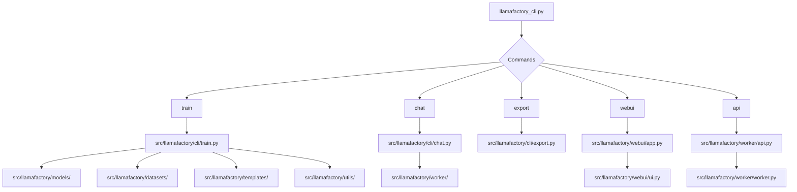
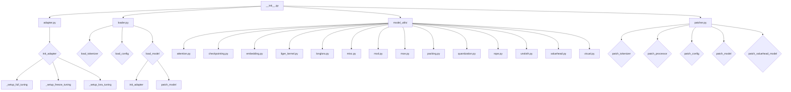

# LLaMA Factory架构分析

## 目录结构

```
LLaMA-Factory-0.9.1/
├── .github/                  # GitHub配置文件
│   ├── workflows/            # GitHub Actions工作流
│   ├── ISSUE_TEMPLATE/       # GitHub Issue模板  
│   ├── PULL_REQUEST_TEMPLATE.md
│   ├── CODE_OF_CONDUCT.md
│   ├── CONTRIBUTING.md  
│   └── SECURITY.md
├── assets/                   # 项目资源文件
├── data/                     # 数据集相关
├── docker/                   # Docker相关配置
│   ├── docker-cuda/          # CUDA版Docker配置
│   ├── docker-npu/           # NPU版Docker配置  
│   └── docker-rocm/          # ROCm版Docker配置
├── examples/                 # 示例配置文件
├── scripts/                  # 辅助脚本
└── src/                      # 项目源代码
    ├── llamafactory/
    │   ├── cli/              # 命令行接口
    │   ├── datasets/         # 数据集处理
    │   ├── models/           # 模型定义  
    │   ├── templates/        # 模板定义
    │   ├── utils/            # 工具函数
    │   ├── webui/            # Web UI
    │   └── worker/           # 推理worker
    └── llamafactory_cli.py   # 命令行入口
```

## 架构图



- `llamafactory_cli.py` 是整个项目的命令行入口,定义了train、chat、export、webui、api等命令
- train命令的实现在 `src/llamafactory/cli/train.py`,主要用到models、datasets、templates、utils等模块
- chat命令的实现在 `src/llamafactory/cli/chat.py`,主要用到worker模块进行推理
- export命令的实现在 `src/llamafactory/cli/export.py`,用于导出模型
- webui命令会启动一个基于Gradio的Web UI,入口在`src/llamafactory/webui/app.py`,UI的具体实现在`src/llamafactory/webui/ui.py` 
- api命令会启动一个类似OpenAI的API服务,实现在`src/llamafactory/worker/api.py`,底层用到worker模块

## 关键模块说明

- **models**: 包含各种支持的模型类的定义,如LLaMA、Bloom、ChatGLM等
- **datasets**: 包含各种数据集的处理逻辑,如Alpaca、Dolly、Vicuna等
- **templates**: 包含对话、问答等场景下的prompt模板
- **utils**: 包含配置解析、日志、评估等各种工具函数
- **worker**: 包含模型推理的worker实现,支持多种backend如vLLM
- **webui**: 基于Gradio实现的Web UI,包含模型训练和测试等功能

## LlamaFactory 模型模块架构分析

本文档基于 LlamaFactory 的 `src/llamafactory/model` 目录,对其中的模块和脚本进行详细分析和拆解,并使用 mermaid 绘制流程架构图,以辅助阅读代码和理解模型的整体架构。

## 模块概览

`src/llamafactory/model` 目录包含以下模块和脚本:

- `__init__.py`: 模块初始化文件,定义了一些常量和工具函数。
- `adapter.py`: 适配器模块,用于初始化和配置模型适配器。
- `loader.py`: 加载器模块,用于加载模型配置、分词器和预训练模型。
- `model_utils/`: 模型工具模块目录,包含各种模型相关的工具函数和类。
- `patcher.py`: 修补器模块,用于修补模型配置、分词器、处理器和模型。

## 流程架构图

下面使用 mermaid 绘制了 LlamaFactory 模型模块的流程架构图:



## 模块详解

### `__init__.py`

模块初始化文件,定义了一些常量和工具函数,包括:

- `QuantizationMethod`: 量化方法枚举类。
- `load_config`: 加载模型配置的函数。
- `load_model`: 加载预训练模型的函数。
- `load_tokenizer`: 加载分词器的函数。
- `find_all_linear_modules`: 查找所有线性模块的函数。
- `load_valuehead_params`: 加载价值头参数的函数。

### `adapter.py`

适配器模块,用于初始化和配置模型适配器,主要函数包括:

- `_setup_full_tuning`: 设置完整微调。
- `_setup_freeze_tuning`: 设置冻结微调。
- `_setup_lora_tuning`: 设置 LoRA 微调。
- `init_adapter`: 初始化适配器的入口函数。

### `loader.py`

加载器模块,用于加载模型配置、分词器和预训练模型,主要函数包括:

- `load_tokenizer`: 加载分词器。
- `load_config`: 加载模型配置。
- `load_model`: 加载预训练模型。

### `model_utils/`

模型工具模块目录,包含各种模型相关的工具函数和类,主要模块包括:

- `attention.py`: 注意力机制相关工具函数。
- `checkpointing.py`: 梯度检查点相关工具函数。
- `embedding.py`: 词嵌入相关工具函数。
- `liger_kernel.py`: Liger 核心相关工具函数。
- `longlora.py`: LongLoRA 相关工具函数。
- `misc.py`: 其他杂项工具函数。
- `mod.py`: MoD 相关工具函数。
- `moe.py`: MoE 相关工具函数。
- `packing.py`: 序列打包相关工具函数。
- `quantization.py`: 量化相关工具函数。
- `rope.py`: RoPE 相关工具函数。
- `unsloth.py`: Unsloth 相关工具函数。
- `valuehead.py`: 价值头相关工具函数。
- `visual.py`: 视觉模型相关工具函数。

### `patcher.py`

修补器模块,用于修补模型配置、分词器、处理器和模型,主要函数包括:

- `patch_tokenizer`: 修补分词器。
- `patch_processor`: 修补处理器。
- `patch_config`: 修补模型配置。
- `patch_model`: 修补模型。
- `patch_valuehead_model`: 修补价值头模型。

以上就是对 LlamaFactory 模型模块的详细分析和拆解,以及使用 mermaid 绘制的流程架构图。通过这个架构图,我们可以更清晰地了解模型模块的整体结构和各个模块之间的关系,从而更好地阅读和理解代码。

以上就是我对LLaMA Factory 0.9.1版本的架构分析,通过mermaid图展示了整体的架构和模块之间的调用关系,并对关键模块进行了说明,希望对你阅读和理解代码有所帮助。 