# LlamaFactory 训练模块架构分析

本文档基于 LlamaFactory 的 `src/llamafactory/train` 目录,对其中的模块和脚本进行详细分析和拆解,并使用 mermaid 绘制流程架构图,以辅助阅读代码和理解训练的整体架构。

## 模块概览

`src/llamafactory/train` 目录包含以下模块和脚本:

- `__init__.py`: 模块初始化文件。
- `callbacks.py`: 自定义回调函数模块。
- `dpo/`: DPO 训练流程相关模块。
- `kto/`: KTO 训练流程相关模块。
- `ppo/`: PPO 训练流程相关模块。
- `pt/`: 预训练流程相关模块。
- `rm/`: 奖励模型训练流程相关模块。
- `sft/`: 监督微调训练流程相关模块。
- `test_utils.py`: 测试工具模块。
- `trainer_utils.py`: Trainer 工具函数模块。

## 流程架构图

下面使用 mermaid 绘制了 LlamaFactory 训练模块的流程架构图:

```mermaid
graph TD
    A[__init__.py] --> B[callbacks.py]
    A --> C[dpo/]
    A --> D[kto/]
    A --> E[ppo/]
    A --> F[pt/]
    A --> G[rm/]
    A --> H[sft/]
    A --> I[test_utils.py]
    A --> J[trainer_utils.py]

    C --> K[__init__.py]
    C --> L[trainer.py]
    C --> M[workflow.py]

    D --> N[__init__.py]
    D --> O[trainer.py]
    D --> P[workflow.py]

    E --> Q[__init__.py]
    E --> R[ppo_utils.py]
    E --> S[trainer.py]
    E --> T[workflow.py]

    F --> U[__init__.py]
    F --> V[trainer.py]
    F --> W[workflow.py]

    G --> X[__init__.py]
    G --> Y[metric.py]
    G --> Z[trainer.py]
    G --> AA[workflow.py]

    H --> AB[__init__.py]
    H --> AC[metric.py]
    H --> AD[trainer.py]
    H --> AE[workflow.py]
```

## 模块详解

### `callbacks.py`

自定义回调函数模块,包含以下回调函数:

- `FixValueHeadModelCallback`: 修复价值头模型的回调函数。
- `PissaConvertCallback`: PiSSA 转换的回调函数。
- `SaveProcessorCallback`: 保存处理器的回调函数。

### `dpo/`

DPO (Distillation with Preference Ordering) 训练流程相关模块,包含以下模块和脚本:

- `__init__.py`: 模块初始化文件。
- `trainer.py`: 自定义 DPO Trainer 模块。
- `workflow.py`: DPO 训练流程模块。

### `kto/`

KTO (Knowledge Transfer with Ordering) 训练流程相关模块,包含以下模块和脚本:

- `__init__.py`: 模块初始化文件。
- `trainer.py`: 自定义 KTO Trainer 模块。
- `workflow.py`: KTO 训练流程模块。

### `ppo/`

PPO (Proximal Policy Optimization) 训练流程相关模块,包含以下模块和脚本:

- `__init__.py`: 模块初始化文件。
- `ppo_utils.py`: PPO 工具函数模块。
- `trainer.py`: 自定义 PPO Trainer 模块。
- `workflow.py`: PPO 训练流程模块。

### `pt/`

预训练流程相关模块,包含以下模块和脚本:

- `__init__.py`: 模块初始化文件。
- `trainer.py`: 自定义预训练 Trainer 模块。
- `workflow.py`: 预训练流程模块。

### `rm/`

奖励模型训练流程相关模块,包含以下模块和脚本:

- `__init__.py`: 模块初始化文件。
- `metric.py`: 奖励模型评估指标模块。
- `trainer.py`: 自定义奖励模型 Trainer 模块。
- `workflow.py`: 奖励模型训练流程模块。

### `sft/`

监督微调训练流程相关模块,包含以下模块和脚本:

- `__init__.py`: 模块初始化文件。
- `metric.py`: 监督微调评估指标模块。
- `trainer.py`: 自定义监督微调 Trainer 模块。
- `workflow.py`: 监督微调训练流程模块。

### `test_utils.py`

测试工具模块,包含以下函数:

- `compare_model`: 比较两个模型的函数。
- `check_lora_model`: 检查 LoRA 模型的函数。
- `load_train_model`: 加载训练模型的函数。
- `load_infer_model`: 加载推理模型的函数。
- `load_reference_model`: 加载参考模型的函数。
- `load_train_dataset`: 加载训练数据集的函数。
- `patch_valuehead_model`: 修补价值头模型的函数。

### `trainer_utils.py`

Trainer 工具函数模块,包含以下函数:

- `DummyOptimizer`: 虚拟优化器类。
- `create_custom_optimizer`: 创建自定义优化器的函数。
- `create_custom_scheduler`: 创建自定义学习率调度器的函数。
- `create_ref_model`: 创建参考模型的函数。
- `create_reward_model`: 创建奖励模型的函数。
- `create_modelcard_and_push`: 创建模型卡片并推送的函数。
- `get_batch_logps`: 获取批次对数概率的函数。

以上就是对 LlamaFactory 训练模块的详细分析和拆解,以及使用 mermaid 绘制的流程架构图。通过这个架构图,我们可以更清晰地了解训练模块的整体结构和各个模块之间的关系,从而更好地阅读和理解代码。 