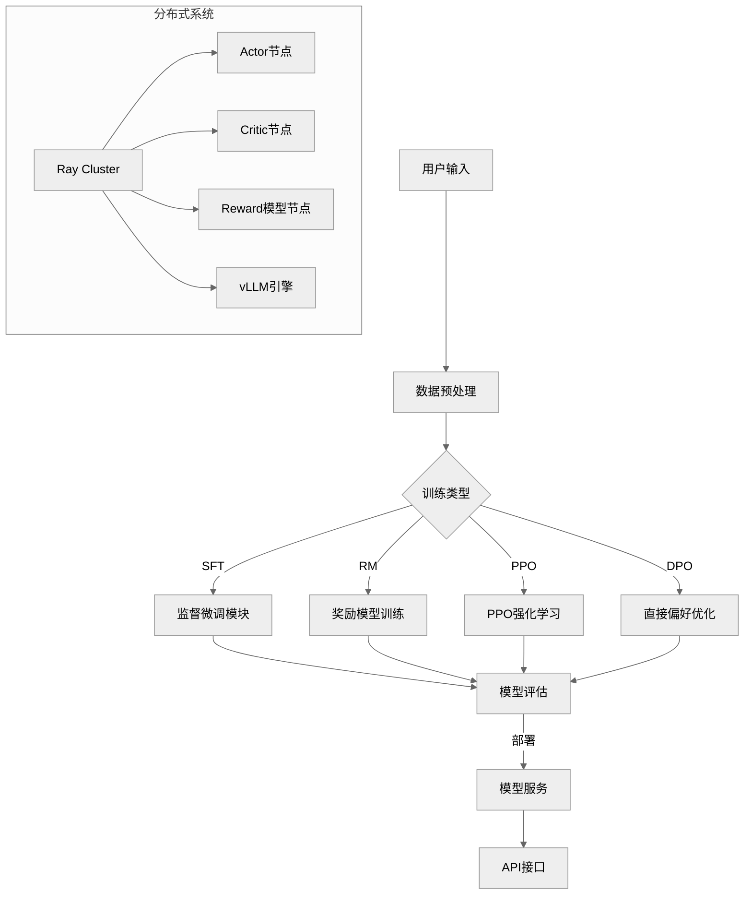

# OpenRLHF 架构解析

## 系统架构图



## 目录结构详解

```
OpenRLHF/
├── .github/                  # CI/CD 自动化配置
│   └── workflows/
│       └── python-package.yml # 自动构建和发布流程
├── dockerfile/               # 容器化部署配置
│   ├── Dockerfile            # 基础镜像定义（基于NVIDIA PyTorch）
│   └── docker-entrypoint.sh  # 容器启动入口脚本
├── docs/                     # 文档资源
│   ├── logo.png              # 项目Logo
│   ├── ppo_examples.md       # PPO训练示例
│   └── technical_report.pdf  # 技术白皮书
├── examples/                 # 使用案例
│   └── scripts/              # 训练脚本集
│       ├── train_ppo_llama_ray.sh      # Ray分布式PPO
│       ├── train_dpo_llama.sh          # DPO训练 
│       ├── serve_remote_rm.sh          # 奖励模型服务
│       └── docker_run.sh               # 容器运行脚本
├── openrlhf/                 # 核心源码
│   ├── cli/                  # 命令行接口
│   │   ├── train_ppo.py      # PPO训练入口
│   │   ├── train_dpo.py      # DPO训练入口
│   │   └── interactive_chat.py # 交互式对话
│   ├── datasets/             # 数据处理
│   │   ├── prompts_dataset.py # 提示数据集
│   │   ├── reward_dataset.py # 奖励模型数据集
│   │   └── sft_dataset.py    # SFT数据集
│   ├── trainer/              # 训练逻辑
│   │   ├── ray/              # Ray分布式实现
│   │   └── utils.py          # 工具函数
│   └── models/               # 模型定义
│       ├── actor.py          # Actor模型
│       ├── critic.py         # Critic模型
│       └── loss.py           # 损失函数
├── tests/                    # 测试用例
├── .gitignore
├── LICENSE
├── README*.md                # 多语言文档
├── setup.py                  # 包配置
└── requirements.txt          # 依赖清单
```

## 核心流程说明

1. **数据预处理阶段**：
   - 使用`apply_chat_template`处理对话数据
   - 支持多数据集混合和样本打包(packing_samples)
   - 生成适用于不同任务的格式化输入

2. **训练编排系统**：
   ```mermaid
   sequenceDiagram
       participant User
       participant RayCluster
       participant DeepSpeed
       participant vLLM
       
       User->>RayCluster: 提交训练任务
       RayCluster->>DeepSpeed: 分配计算资源
       DeepSpeed->>vLLM: 请求生成服务
       vLLM->>DeepSpeed: 返回生成结果
       DeepSpeed->>RayCluster: 聚合训练数据
       RayCluster->>User: 返回训练结果
   ```

3. **混合引擎工作流**：
   - Actor/Critic/Reward模型共享GPU资源
   - 动态调度vLLM引擎资源
   - 自动处理模型卸载(offload)和内存优化

4. **分布式训练架构**：
   ```mermaid
   graph LR
       C[Controller]
       C -->|调度| D[Ray Head Node]
       D --> E[Actor Group]
       D --> F[Critic Group] 
       D --> G[Reward Model Group]
       D --> H[vLLM Engines]
       
       E -->|生成样本| H
       F -->|价值评估| G
       G -->|奖励计算| E
       H -->|加速生成| E
   ```

## 关键创新点

1. **混合精度训练**：
   ```python
   # openrlhf/models/actor.py
   class Actor(nn.Module):
       def __init__(self, bf16=True, load_in_4bit=False, ...):
           if bf16:
               model = AutoModelForCausalLM.from_pretrained(..., torch_dtype=torch.bfloat16)
   ```

2. **分布式通信优化**：
   ```python
   # openrlhf/utils.py
   def setup_distributed_communication():
       os.environ["NCCL_IB_DISABLE"] = "1"
       torch.distributed.init_process_group(backend="nccl")
   ```

3. **高效注意力机制**：
   ```python
   # openrlhf/models/ring_attn_utils.py
   def convert_ring_attn_params(input_ids, attention_mask, ...):
       # 实现环形注意力机制
       return optimized_inputs
   ```

建议结合代码库中的具体实现（如`openrlhf/trainer/ray`目录下的分布式训练逻辑）来深入理解各模块的交互细节。关键创新点在于将Ray的灵活资源调度与DeepSpeed的训练优化相结合，同时通过vLLM实现高效生成。 