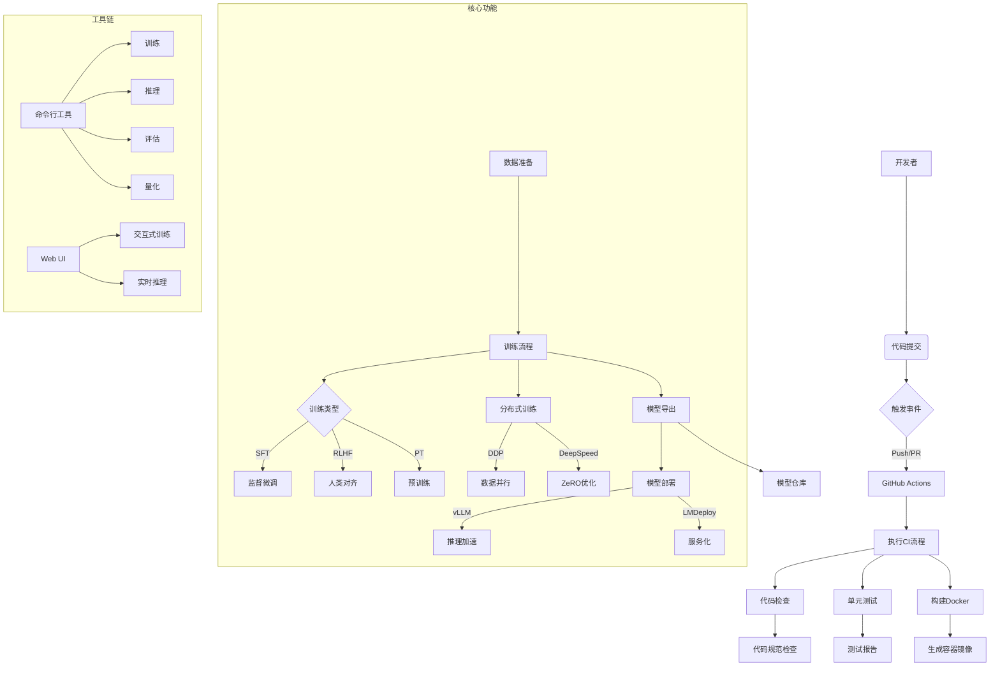
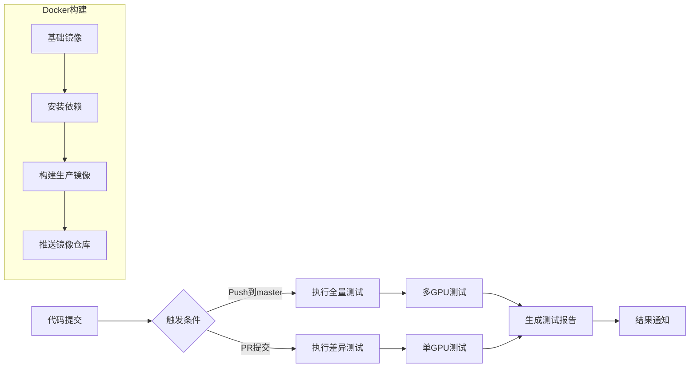
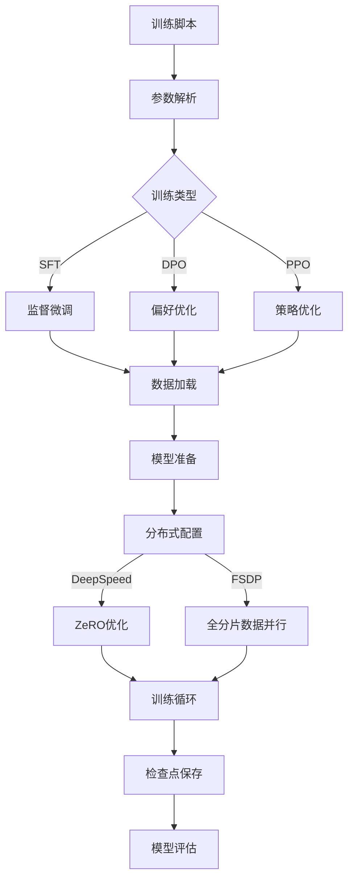
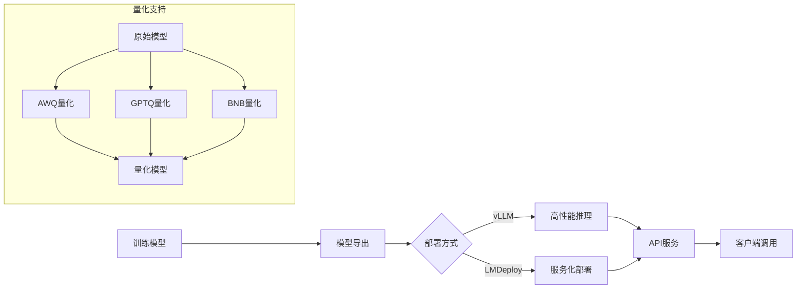
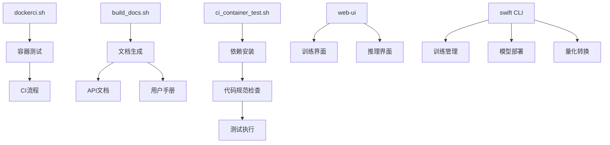
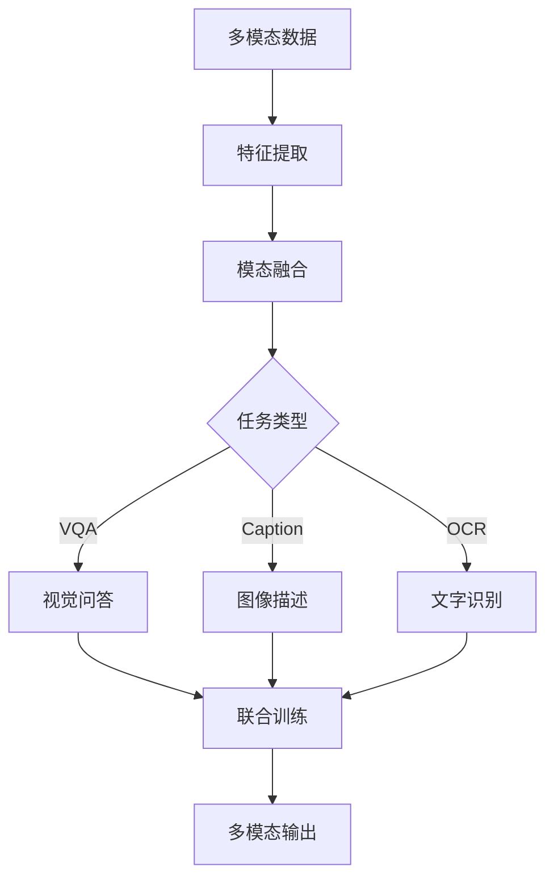

# MS-SWIFT 架构分析

## 整体架构流程



## 关键模块解析

### 1. CI/CD 流程


### 2. 训练系统架构


### 3. 推理部署流程


## 核心脚本关系



## 关键特性实现

### 1. 分布式训练配置
```python
# .dev_scripts/ci_container_test.sh
if [ "$MODELSCOPE_SDK_DEBUG" == "True" ]; then
    pip install -r requirements/framework.txt -U
    pip install diffusers decord einops -U
    pip install autoawq -U --no-deps
fi
```

### 2. 模型加速支持
```python
# dockerci.sh
--gpus='"'"device=$gpu"'"' \
-v $MODELSCOPE_CACHE:$MODELSCOPE_CACHE_DIR_IN_CONTAINER \
-e CUDA_VISIBLE_DEVICES=$gpu \
--cpuset-cpus=${cpu_sets_arr[$idx]} \
```

### 3. 多模态训练流程


## 性能优化策略

1. **混合精度训练**：
```shell
# 训练脚本参数
--torch_dtype bfloat16 \
--mixed_precision fp16 \
```

2. **内存优化**：
```python
# 使用DeepSpeed Zero优化
--deepspeed zero2 \
--gradient_accumulation_steps 16 \
```

3. **并行处理**：
```shell
# 数据加载优化
--dataloader_num_workers 8 \
--preprocessing_num_workers 16 \
```

4. **缓存优化**：
```python
# 模型缓存配置
-v $MODELSCOPE_CACHE:$MODELSCOPE_CACHE_DIR_IN_CONTAINER \
-e HF_HOME=/modelscope_cache \
``` 