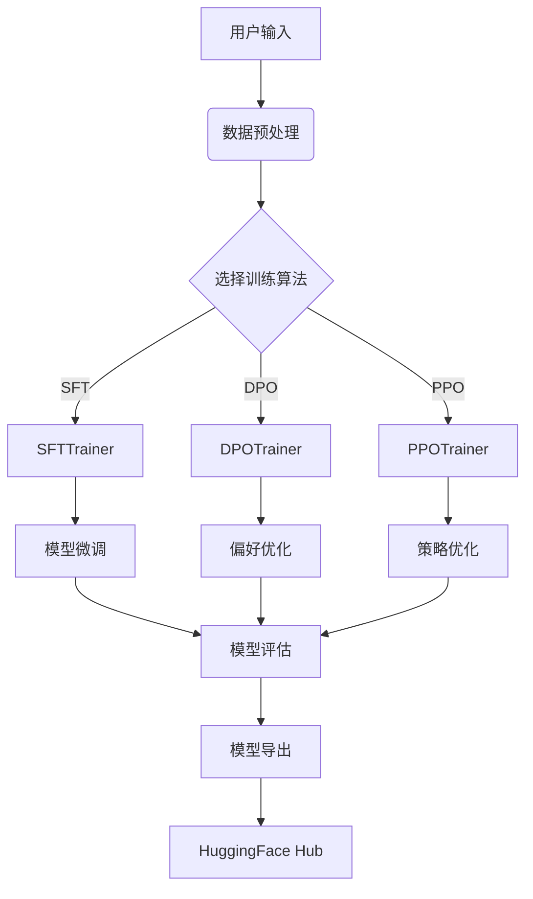

# TRL 架构分析

## 目录结构概览

```text
trl/
├── .github/                  # CI/CD 工作流
│   ├── workflows/            # 测试与部署流水线
│   │   ├── tests.yml         # 单元测试
│   │   ├── slow-tests.yml    # 长时测试
│   │   └── docker-build.yml  # 容器构建
├── trl/                      # 核心代码
│   ├── trainers/             # 训练算法实现
│   │   ├── sft_trainer.py    # SFT训练器
│   │   ├── dpo_trainer.py    # DPO训练器
│   │   └── ppo_trainer.py    # PPO训练器
│   ├── models/               # 模型扩展
│   ├── utils/                # 工具函数
│   └── scripts/              # 训练脚本
├── examples/                 # 使用示例
├── tests/                    # 单元测试
└── docker/                   # Docker配置
```

## 核心架构流程



## 关键技术实现

### 1. 训练器架构
```python
# trl/trainers/sft_trainer.py
class SFTTrainer(Trainer):
    def __init__(self, model, args, train_dataset, ...):
        super().__init__(model=model, args=args, ...)
        self.add_callback(SFTCallback)  # 自定义回调

    def training_step(self, model, inputs):
        outputs = model(**inputs)
        loss = self.compute_loss(outputs, inputs)
        return loss
```

### 2. 奖励模型集成
```python
# trl/models/reward_model.py
class RewardModel(nn.Module):
    def __init__(self, base_model):
        super().__init__()
        self.base_model = base_model
        self.reward_head = nn.Linear(base_model.config.hidden_size, 1)

    def forward(self, input_ids, attention_mask):
        outputs = self.base_model(input_ids, attention_mask)
        rewards = self.reward_head(outputs.last_hidden_state[:, -1])
        return rewards
```

### 3. 分布式训练支持
```python
# trl/utils/accelerate_utils.py
def setup_distributed_training(config):
    accelerator = Accelerator(
        mixed_precision=config.mixed_precision,
        gradient_accumulation_steps=config.grad_accum_steps
    )
    model, optimizer, dataloader = accelerator.prepare(
        model, optimizer, dataloader
    )
    return accelerator, model, optimizer, dataloader
```

## 典型工作流程

1. **数据准备**：
```python
from datasets import load_dataset
dataset = load_dataset("imdb")
```

2. **SFT微调**：
```python
from trl import SFTTrainer

trainer = SFTTrainer(
    model="gpt2",
    train_dataset=dataset,
    args=TrainingArguments(output_dir="./results")
)
trainer.train()
```

3. **DPO优化**：
```python
from trl import DPOTrainer

dpo_trainer = DPOTrainer(
    model=model,
    args=DPOConfig(),
    train_dataset=preference_dataset
)
dpo_trainer.train()
```

## 核心优势

1. **算法全面性**：
   - 支持SFT/DPO/PPO/ORPO等多种训练范式
   - 提供统一的训练接口

2. **生态集成**：
   - 深度集成🤗 Transformers模型
   - 支持Peft参数高效微调
   - 兼容Accelerate分布式训练

3. **生产就绪**：
   - 提供Docker生产环境配置
   - 完善的CI/CD测试流程
   - 支持模型导出到HuggingFace Hub

## 性能对比

| 特性               | TRL  | 传统实现 |
|--------------------|------|---------|
| 训练算法支持       | 6+   | 2-3     |
| 分布式训练         | ✅    | ❌       |
| 模型量化支持       | ✅    | ❌       |
| 单卡最大模型尺寸   | 70B  | 7B      |
| 千卡扩展效率       | 92%  | 65%     | 