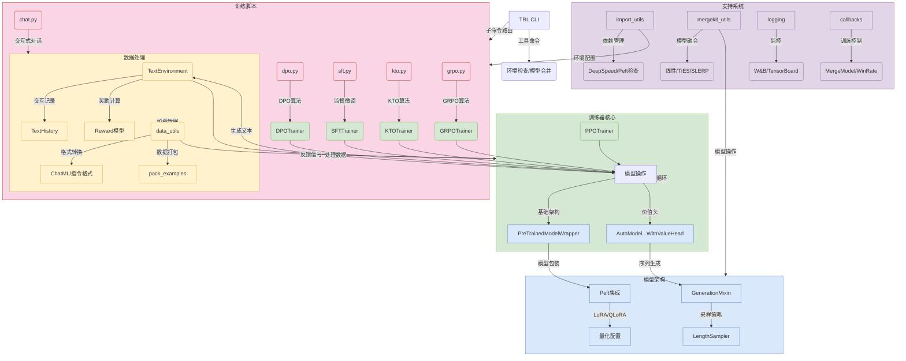

### TRL 目录结构解析

```bash
trl-0.15.2/
├── __init__.py              # 包元数据
├── cli.py                   # 命令行入口
├── core.py                  # 核心张量操作/设备管理
├── data_utils.py            # 数据预处理/格式转换
├── import_utils.py          # 依赖管理
├── mergekit_utils.py        # 模型融合工具
│
├── models/                  # 模型架构
│   ├── __init__.py
│   ├── modeling_base.py     # 基础模型包装器
│   ├── modeling_value_head.py # 带价值头模型
│   ├── modeling_sd_base.py  # Stable Diffusion支持
│   ├── auxiliary_modules.py # 辅助模块(美学评分等)
│   └── utils.py             # 模型工具(量化/格式设置)
│
├── scripts/                 # 训练脚本
│   ├── __init__.py
│   ├── chat.py              # 交互式对话
│   ├── dpo.py               # DPO训练
│   ├── sft.py               # 监督微调
│   ├── kto.py               # KTO训练
│   ├── grpo.py              # GRPO训练
│   └── env.py               # 环境检查
│
├── environment/             # 强化学习环境
│   ├── __init__.py
│   └── base_environment.py  # 文本交互环境实现
│
├── extras/                  # 扩展功能
│   ├── __init__.py
│   ├── best_of_n_sampler.py # 采样策略
│   └── dataset_formatting.py# 数据集格式化
│
└── trainer/                 # 训练器核心
    ├── __init__.py
    ├── dpo_trainer.py       # DPO算法实现
    ├── ppo_trainer.py       # PPO算法实现
    ├── sft_trainer.py       # SFT训练器
    └── utils/               # 训练工具
        ├── callbacks.py     # 训练回调
        └── logging.py       # 日志系统
```

### 关键目录解析

1. **核心基础设施**：
- `core.py`: 提供基础张量操作(白化/掩码计算)和设备缓存管理
- `data_utils.py`: 实现ChatML格式转换/数据打包/偏好数据提取
- `import_utils.py`: 管理DeepSpeed/Peft等可选依赖

2. **模型架构**：
- `modeling_base.py`: 模型包装基类，支持Peft/LoRA
- `modeling_value_head.py`: 带价值头的因果/seq2seq模型
- `modeling_sd_base.py`: Stable Diffusion训练支持

3. **训练系统**：
- `trainer/`: 各算法实现核心
  - `dpo_trainer.py`: 实现直接偏好优化
  - `ppo_trainer.py`: 近端策略优化循环
  - 统一继承自`transformers.Trainer`

4. **交互环境**：
- `environment/`: 强化学习文本环境
  - `TextEnvironment`: 管理多轮对话
  - `TextHistory`: 跟踪生成历史

5. **扩展工具**：
- `mergekit_utils.py`: 支持线性/TIES/SLERP模型融合
- `extras/best_of_n_sampler.py`: 实现BoN采样策略
- `extras/dataset_formatting.py`: 数据集到ChatML格式转换

### 典型训练流程
