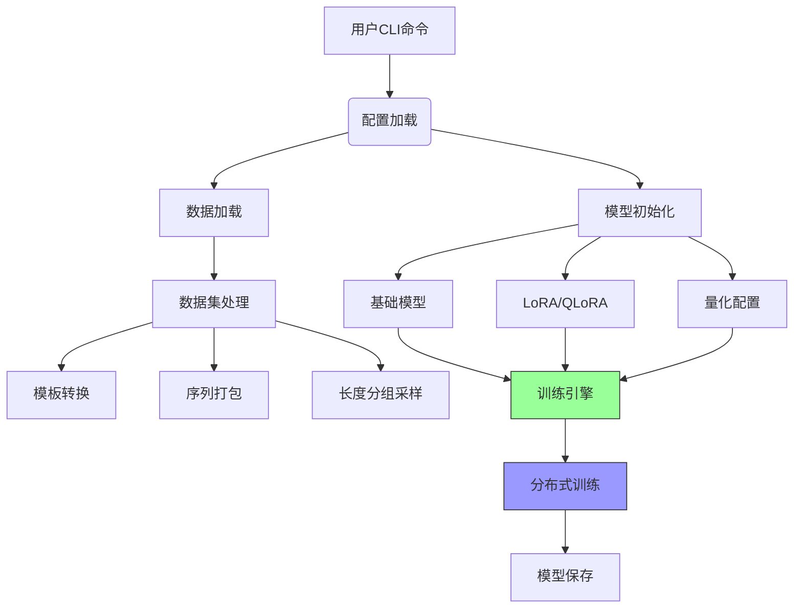
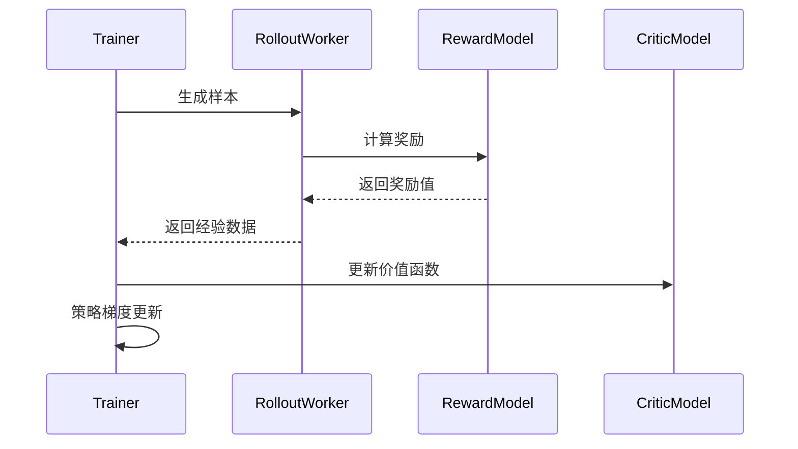
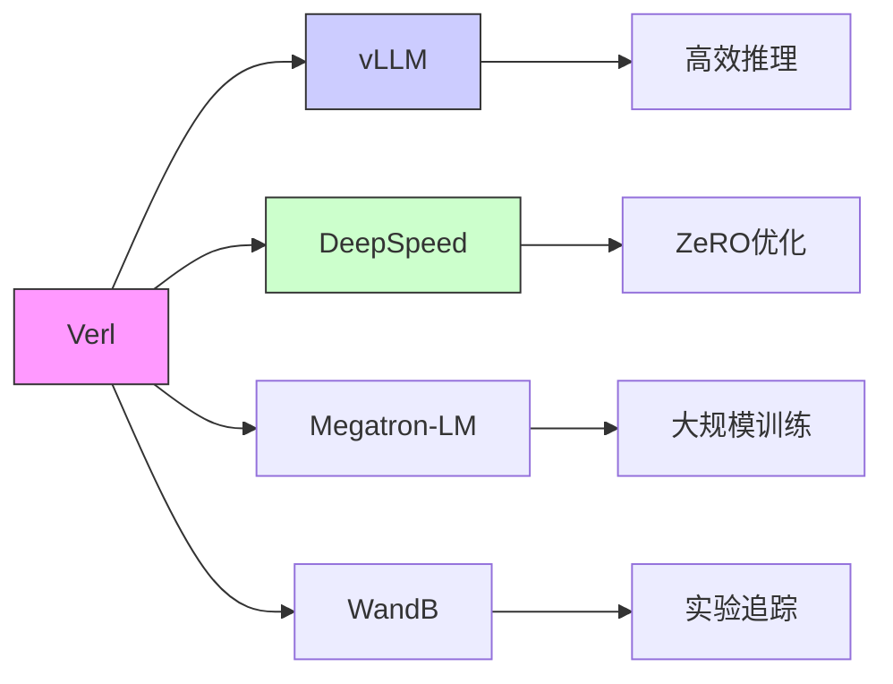

# Verl 架构分析

## 目录结构概览

```text
verl/
├── .github/                  # CI/CD 工作流
│   ├── workflows/            # 测试与部署流水线
│   │   ├── dataset.yml       # 数据集测试
│   │   ├── e2e_*.yml         # 端到端测试
│   │   └── model.yml         # 模型测试
├── docs/                     # 文档系统
├── src/
│   ├── verl/                 # 核心代码
│   │   ├── engine/           # 训练引擎
│   │   ├── model/            # 模型架构
│   │   ├── rollout/          # 推理生成
│   │   └── utils/            # 工具函数
│   ├── examples/             # 使用示例
│   └── tests/                # 单元测试
├── docker/                   # 容器化配置
└── configs/                  # 训练配置模板
```

## 核心训练流程



## 关键模块说明

### 1. 模型架构 (`src/verl/model`)
```python
class TransformerWithRMPAD(nn.Module):
    def __init__(self, config):
        super().__init__()
        self.embed_tokens = nn.Embedding(...)
        self.layers = nn.ModuleList([DecoderLayer(config) for _ in ...])
        self.norm = nn.LayerNorm(...)
        
    def forward(self, input_ids, attention_mask=None):
        # RMPAD 核心逻辑
        hidden_states = self.embed_tokens(input_ids)
        for layer in self.layers:
            hidden_states = layer(hidden_states, attention_mask)
        return self.norm(hidden_states)
```

### 2. 训练引擎 (`src/verl/engine`)


### 3. 分布式训练 (`src/verl/utils/distributed`)
- 支持多种并行策略：
  - 数据并行
  - 张量并行
  - 流水线并行
- 集成 DeepSpeed 和 Megatron-LM
- 动态批处理与序列平衡

## 工具链集成



## 典型工作流程

1. **数据准备**：
```bash
python examples/data_preprocess/gsm8k.py
```

2. **训练启动**：
```bash
bash examples/ppo_trainer/run_qwen2-7b_seq_balance.sh
```

3. **模型部署**：
```python
from verl.rollout import vLLMEngine
engine = vLLMEngine(model="qwen-7b", tensor_parallel_size=8)
outputs = engine.generate(prompts)
```

该架构图展示了Verl从数据准备到模型部署的完整流程，主要特点包括：

1. 模块化设计：各组件通过配置灵活组合
2. 高效训练：集成DeepSpeed、FlashAttention等优化技术
3. 多框架支持：无缝对接vLLM、Megatron等基础设施
4. 生产就绪：支持大规模分布式训练与部署 