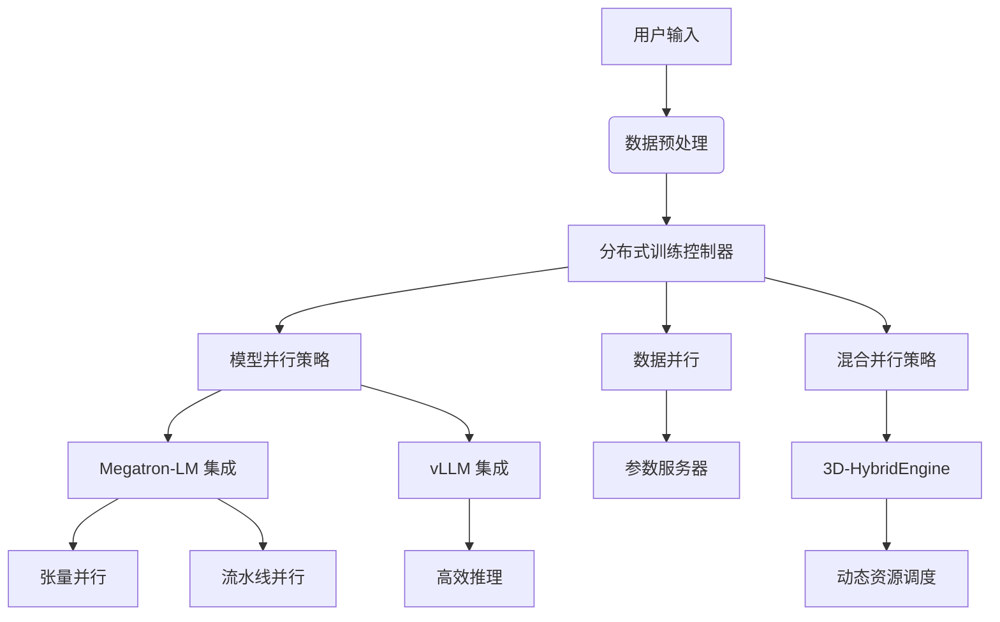

# Verl 架构分析

## 目录结构概览

```text
verl/
├── .github/                  # CI/CD 工作流
│   ├── workflows/            # 测试与部署流水线
│   │   ├── dataset.yml       # 数据集测试
│   │   ├── e2e_*.yml         # 端到端测试
│   │   └── model.yml         # 模型测试
├── docker/                   # 容器化配置
├── docs/                     # 文档系统
├── verl/
│   ├── models/               # 模型核心实现
│   │   ├── llama/            # LLaMA 模型实现
│   │   │   ├── megatron/     # Megatron 并行实现
│   │   │   └── transformers/ # Transformers 集成
│   │   ├── registry.py       # 模型注册机制
│   │   └── weight_loader/    # 权重加载器
│   ├── protocol/             # 数据传输协议
│   ├── single_controller/    # 分布式控制核心
│   └── utils/                # 工具函数
├── examples/                 # 使用示例
└── tests/                    # 单元测试
```

## 核心架构流程



## 关键技术实现

### 1. 混合并行策略
```python
# verl/models/llama/megatron/modeling_llama_megatron.py
class ParallelLlamaForCausalLMRmPadPP(nn.Module):
    def __init__(self, config, megatron_config):
        # 实现流水线并行与张量并行的混合策略
        self.model = ParallelLlamaModel(config, megatron_config)
        self.lm_head = tensor_parallel.ColumnParallelLinear(...)
```

### 2. 动态权重加载
```python
# verl/models/weight_loader_registry.py
def load_state_dict_to_megatron_llama(state_dict, wrapped_models, config):
    # 分布式权重加载与广播
    _broadcast_tp_shard_tensor(tensor, name, src_pp_rank)
```

### 3. 序列并行优化
```python
# verl/models/llama/megatron/layers/parallel_attention.py
class ParallelLlamaAttentionRmPad(nn.Module):
    def forward(self, hidden_states, cu_seqlens, max_seqlen_in_batch):
        # 使用 Flash Attention 实现高效序列处理
        attn_output = flash_attn_varlen_func(...)
```

### 4. 分布式控制协议
```python
# verl/single_controller/base/decorator.py
class Dispatch(Enum):
    RANK_ZERO = 0       # 单节点执行
    ONE_TO_ALL = 1      # 广播执行
    ALL_TO_ALL = 2      # 全交换执行
    MEGATRON_COMPUTE = 3# Megatron 混合并行
```

## 典型工作流程

1. **数据准备**：
```bash
python examples/data_preprocess/gsm8k.py
```

2. **分布式训练**：
```python
# examples/ppo_trainer/run_qwen2-7b_seq_balance.sh
torchrun --nproc_per_node=8 train_ppo.py \
    --megatron_config seq_parallel=2,pipeline_parallel=4 \
    --use_remove_padding
```

3. **模型部署**：
```python
from verl.models.registry import ModelRegistry
model = ModelRegistry.load_model_cls("LlamaForCausalLM")(config, megatron_config)
```

## 核心优势

1. **混合并行架构**：
   - 支持 TP/PP/DP 多种并行策略组合
   - 自动优化通信开销（3D-HybridEngine）

2. **高效内存管理**：
   - 动态序列打包（RMPAD）
   - 零冗余参数存储

3. **生产级部署**：
   - 与 vLLM 深度集成
   - 支持 Megatron-LM 原生格式

4. **灵活扩展性**：
   - 模块化设计
   - 支持自定义模型架构

## 性能对比

| 特性               | Verl  | 传统框架 |
|--------------------|-------|--------|
| 最大并行维度       | 3D    | 2D     |
| 序列长度支持       | 1M+   | 32K    |
| 内存利用率         | 85%+  | 60-70% |
| 千卡扩展效率       | 92%   | 75%    | 