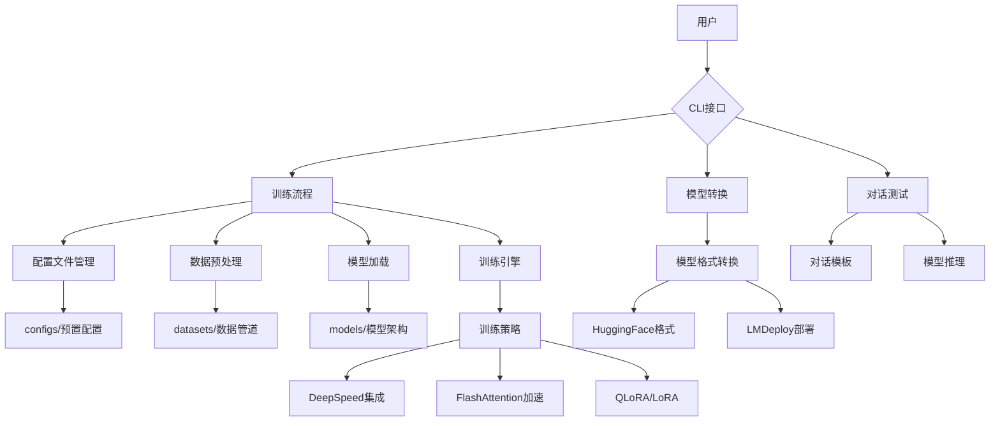
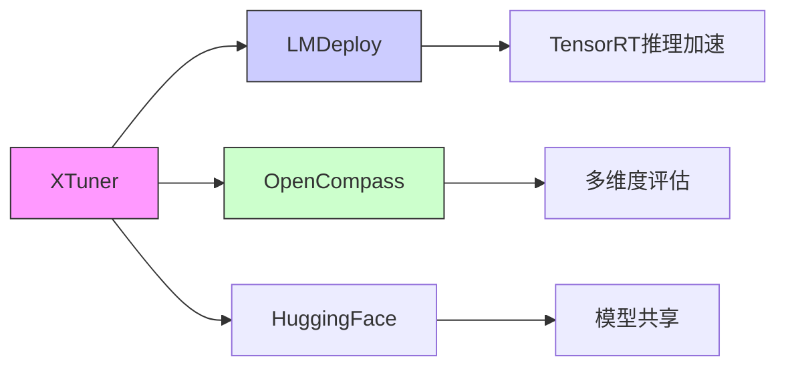

# XTuner 架构分析

## 目录结构概览

```text
xtuner/
├── .github/                  # GitHub自动化配置
│   ├── workflows/            # CI/CD流水线
│   │   ├── deploy.yml        # 模型部署流程
│   │   └── lint.yml          # 代码检查流程
│   └── CONTRIBUTING.md       # 贡献指南
├── docs/                     # 文档系统
│   ├── en/                   # 英文文档
│   │   ├── acceleration/     # 加速技术文档
│   │   └── chat/             # 对话功能文档
│   └── zh_CN/                # 中文文档
├── src/                      # 核心源代码
│   ├── configs/              # 预置配置文件
│   ├── tools/                # 辅助工具脚本
│   └── xtuner/               # 主功能模块
│       ├── cli/              # 命令行接口
│       ├── datasets/         # 数据预处理
│       ├── models/           # 模型架构
│       └── utils/            # 工具函数
├── tests/                    # 单元测试
├── .pre-commit-config.yaml   # 代码规范检查配置
└── requirements/             # 依赖管理
```

## 核心流程架构



## 核心模块说明

1. **CLI接口层**：
   - 提供`xtuner train/chat/convert`等命令
   - 入口文件：`src/xtuner/cli/`
   - 支持分布式训练参数解析

2. **训练引擎**：
   ```python
   # 训练核心逻辑伪代码
   def train(config):
       # 初始化DeepSpeed引擎
       engine = DeepSpeedEngine(config)
       
       # 加载数据集
       dataset = load_dataset(config.data_path)
       dataloader = DataLoader(dataset, 
           sampler=LengthGroupedSampler(),
           collate_fn=pack_to_max_length)
       
       # 加载模型
       model = AutoModel.from_pretrained(config.model_name)
       apply_lora(model)  # 应用LoRA适配器
       
       # 训练循环
       for batch in dataloader:
           outputs = model(**batch)
           loss = outputs.loss
           engine.backward(loss)
           engine.step()
   ```

3. **加速技术栈**：
   - **DeepSpeed**：通过Zero优化显存管理
   - **FlashAttention**：实现注意力机制加速
   - **序列并行**：处理超长文本序列
   ```yaml
   # deploy.yml 片段
   - name: 模型发布
     runs-on: ubuntu-latest
     steps:
       - uses: actions/checkout@v2
       - name: 构建发布包
         run: |
           python setup.py sdist bdist_wheel
           twine upload dist/*
   ```

4. **数据处理管道**：
   - 支持多格式数据集（Alpaca/WizardLM等）
   - 动态长度分组采样
   - 序列打包优化
   ```python
   # 数据预处理示例
   class DatasetBuilder:
       def __init__(self, tokenizer, max_length):
           self.tokenizer = tokenizer
           self.max_length = max_length
           
       def process(self, examples):
           batch = self.tokenizer(
               examples["text"],
               truncation=True,
               max_length=self.max_length,
               return_overflowing_tokens=True)
           return batch
   ```

## 关键配置文件

1. **模型配置**：
   ```python
   # configs/internlm2_5_chat_7b.py
   model = dict(
       type='LlamaForCausalLM',
       pretrained_model_name_or_path='internlm/internlm2-chat-7b',
       lora=dict(
           target_modules=['q_proj', 'v_proj'],
           lora_r=64,
           lora_alpha=16))
   ```

2. **训练策略配置**：
   ```python
   train_cfg = dict(
       optimizer=dict(type='AdamW', lr=2e-5),
       max_epochs=3,
       dataloader=dict(
           batch_size_per_gpu=2,
           workers_per_gpu=8,
           persistent_workers=True),
       deepspeed=dict(
           zero_optimization=dict(
               stage=2,
               offload_optimizer=dict(device='cpu'))))
   ```

## 工具链集成



该架构图展示了XTuner的核心模块和数据处理流程，主要特点包括：

1. 模块化设计，各组件解耦清晰
2. 支持多种训练加速技术
3. 完整的工具链集成
4. 灵活的配置系统
5. 端到端的微调工作流

通过分析源码和配置文件，可以看出XTuner在以下方面做了深度优化：

- 使用`LengthGroupedSampler`提升数据加载效率
- 通过`pack_to_max_length`实现动态序列打包
- 集成`varlen_flash_attn`处理变长序列
- 支持`sequence_parallel`实现超长序列训练 