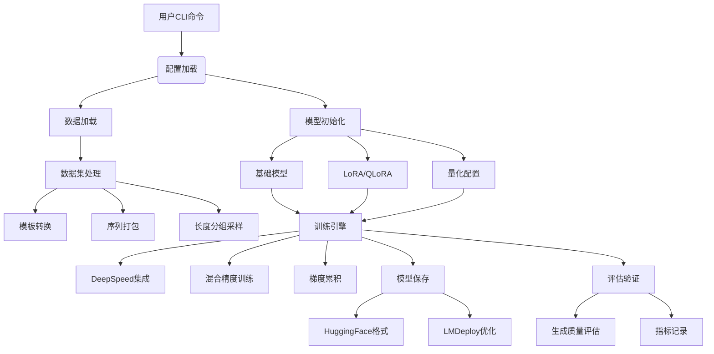
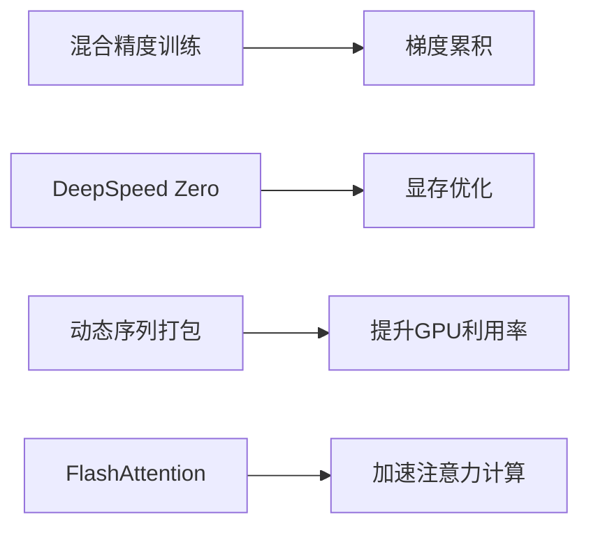
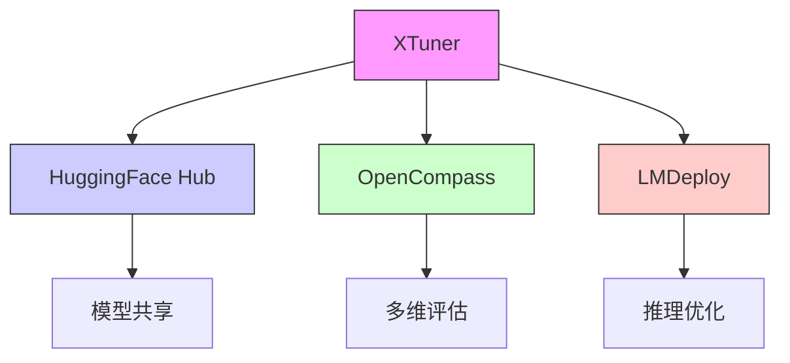

# XTuner 架构分析

## 目录结构概览

```text
xtuner/
├── .github/                  # CI/CD 工作流
│   ├── workflows/
│   │   ├── deploy.yml        # 模型部署流水线
│   │   └── lint.yml          # 代码检查流水线
│   └── CONTRIBUTING.md       # 贡献指南
├── docs/                     # 文档系统
├── src/
│   ├── apis/                 # 高层API接口
│   │   ├── datasets/         # 数据集构建接口
│   │   └── model.py          # 模型构建接口
│   ├── configs/              # 预训练配置
│   ├── dataset/              # 数据处理核心
│   │   ├── collate_fns/      # 数据批处理
│   │   └── map_fns/          # 数据转换逻辑
│   ├── engine/               # 训练引擎
│   ├── model/                # 模型架构
│   ├── tools/                # 实用工具
│   └── utils/                # 辅助函数
├── tests/                    # 单元测试
└── requirements/             # 依赖管理
```

## 核心训练流程



## 核心模块说明

1. **配置系统**：
```python
# 典型配置结构
model = dict(
    type=SupervisedFinetune,
    llm=dict(
        pretrained_model_name_or_path='baichuan-inc/Baichuan2-13B-Base',
        quantization_config=dict(
            load_in_4bit=True,
            bnb_4bit_quant_type='nf4')),
    lora=dict(
        r=64,
        lora_alpha=16))
```

2. **数据处理管道**：
```python
# 数据集处理流程
dataset = process_hf_dataset(
    dataset=load_dataset(path),
    tokenizer=tokenizer,
    max_length=2048,
    dataset_map_fn=alpaca_map_fn,      # 原始数据转换
    template_map_fn=prompt_template,   # 添加对话模板
    pack_to_max_length=True)           # 动态打包
```

3. **训练引擎**：
```python
# 训练循环配置
optim_wrapper = dict(
    type=AmpOptimWrapper,
    optimizer=dict(type=AdamW, lr=2e-5),
    clip_grad=dict(max_norm=1.0))

param_scheduler = [
    dict(type=LinearLR, start_factor=1e-5, end=0.03*3),
    dict(type=CosineAnnealingLR, eta_min=0.0)
]
```

## 关键特性实现

1. **高效训练技术**：


2. **模型适配架构**：
```python
class SupervisedFinetune(nn.Module):
    def __init__(self, llm, lora=None):
        super().__init__()
        self.llm = prepare_model_for_kbit_training(llm)
        if lora:
            self.llm = get_peft_model(self.llm, LoraConfig(**lora))
```

## 工具链集成



## 典型工作流程

1. **配置驱动训练**：
```bash
xtuner train configs/baichuan/baichuan2_13b_base_qlora_alpaca_e3.py
```

2. **交互式测试**：
```python
xtuner chat pretrained_model --adapter adapter_path --prompt-template alpaca
```

3. **模型部署**：
```bash
xtuner convert merge model_path adapter_path --save-path merged_model
lmdeploy convert merged_model --dst-path deployed_model
```

该架构图展示了XTuner从数据准备到模型部署的完整流程，主要特点包括：

1. 模块化设计：各组件通过配置灵活组合
2. 高效训练：集成DeepSpeed、FlashAttention等优化技术
3. 多模态支持：统一处理NLP和多模态任务
4. 生态集成：无缝对接HuggingFace、LMDeploy等工具 