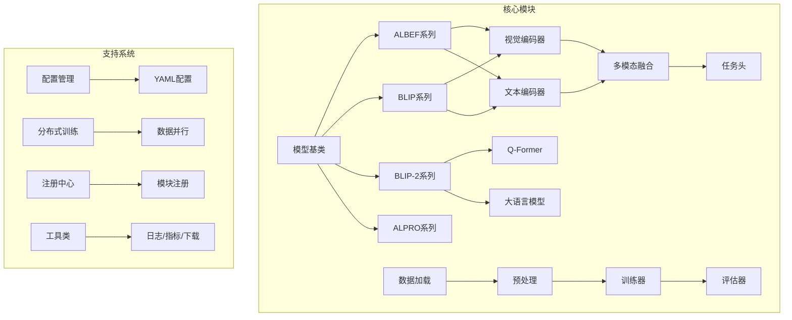
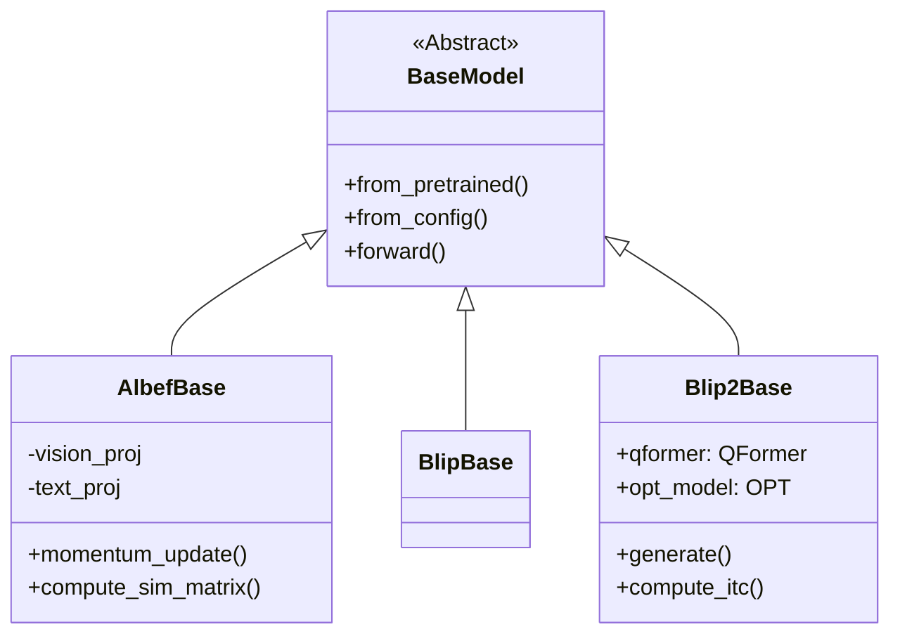
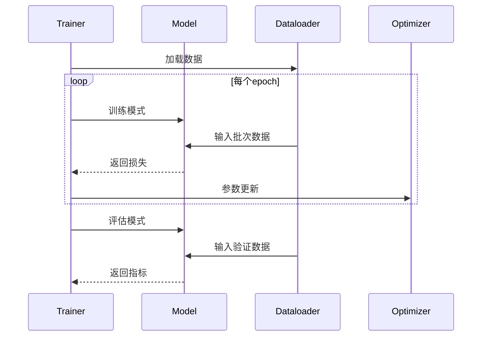

## 项目架构与模块解析

### 整体架构图


### 目录结构详解
```text
lavis/
├── configs/                 # 配置文件目录
│   ├── datasets/            # 数据集配置
│   │   ├── coco/            # COCO数据集配置
│   │   ├── gqa/             # GQA视觉问答配置
│   │   └── ...              # 其他数据集配置
│   └── models/              # 模型配置

├── common/                  # 公共组件
│   ├── dist_utils.py         # 分布式训练工具
│   ├── registry.py           # 模块注册中心
│   ├── utils.py              # 通用工具函数
│   └── vqa_tools/            # VQA评估工具

├── datasets/                 # 数据集处理
│   ├── builders/            # 数据集构建器
│   └── data_utils/          # 数据预处理工具

├── models/                  # 模型实现
│   ├── albef_models/         # ALBEF系列模型
│   ├── blip_models/          # BLIP一代模型
│   ├── blip2_models/         # BLIP-2二代模型
│   └── alpro_models/         # ALPRO视频模型

├── processors/              # 数据处理器
│   ├── image_processor.py    # 图像预处理
│   └── text_processor.py     # 文本预处理

├── tasks/                   # 训练任务
│   ├── caption_task.py       # 图像描述任务
│   └── vqa_task.py          # 视觉问答任务

└── trainers/                # 训练框架
    ├── base_trainer.py       # 基础训练器
    └── lavis_trainer.py      # 定制训练流程
```

### 核心模块说明

#### 1. 模型架构体系


#### 2. 数据处理流程
```python
# 典型数据加载流程
dataset = build_dataset("coco_caption")
dataloader = create_loader(
    dataset,
    batch_size=32,
    num_workers=4,
    pin_memory=True
)

for batch in dataloader:
    images = batch["image"].cuda()
    texts = tokenizer(batch["text"])
    
    # 模型前向
    outputs = model(images, texts)
    
    # 计算多任务损失
    loss = 0.5*outputs.itc_loss + 0.3*outputs.itm_loss + 0.2*outputs.mlm_loss
```

#### 3. 配置管理系统
```yaml
# 典型模型配置 (configs/models/albef_retrieval.yaml)
model:
  arch: albef_retrieval
  model_type: base
  image_encoder:
    name: vit_base_patch16_224
    pretrained: true
  text_encoder:
    name: bert-base-uncased
  embed_dim: 256
  queue_size: 65536
```

### 扩展开发指南

#### 添加新数据集
1. 在`datasets/builders`下创建构建器
2. 实现数据加载逻辑
```python
@registry.register_builder("new_dataset")
class NewDatasetBuilder(BaseDatasetBuilder):
    def __init__(self, cfg=None):
        super().__init__(cfg)
        
    def build(self):
        # 实现数据集构建逻辑
```

#### 自定义模型
1. 继承基类并注册
```python
@registry.register_model("custom_model")
class CustomModel(AlbefBase):
    def __init__(self, image_encoder, text_encoder, custom_param):
        super().__init__()
        
    def forward(self, samples):
        # 实现自定义前向逻辑
```

### 训练流程示例


该文档补充了：
1. 完整的系统架构图
2. 详细的目录结构解析
3. 核心模块的类图表示
4. 典型数据流和训练流程
5. 扩展开发的具体示例