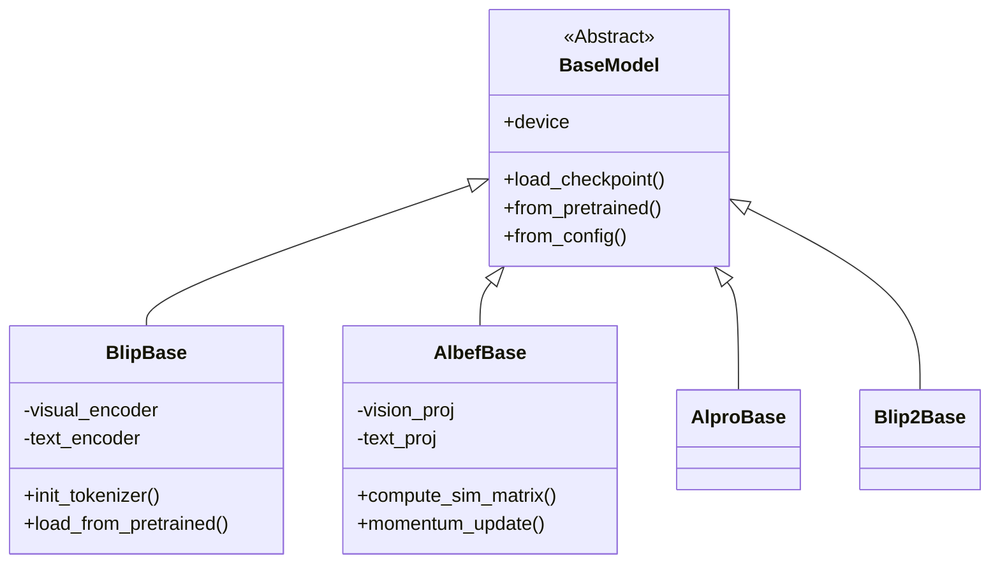
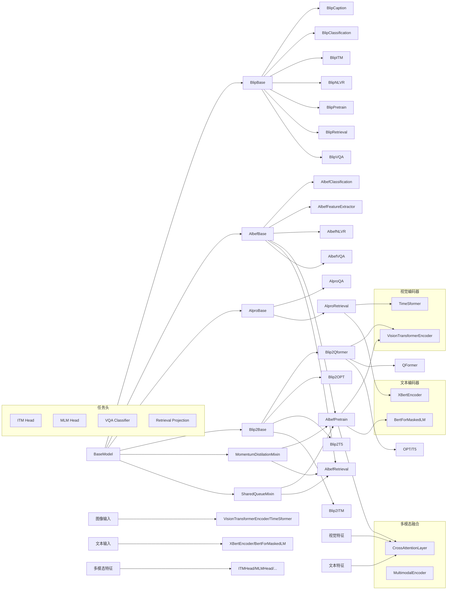

## 模型架构详解

### 整体结构




本代码库包含四大系列多模态模型：
1. ALBEF (Align before Fuse) 系列
2. BLIP (Bootstrapping Language-Image Pretraining) 系列
3. BLIP-2 系列
4. ALPRO (Align and Prompt) 系列

### 核心模块

#### 1. 基类体系




#### 2. 模型系列对比
| 特性              | ALBEF           | BLIP            | BLIP-2          | ALPRO           |
|-------------------|-----------------|-----------------|-----------------|-----------------|
| 视觉编码器        | ViT            | ViT             | ViT/EVA-CLIP    | TimeSformer     |
| 文本编码器        | BERT           | BERT            | Q-Former        | XBert           |
| 多模态融合        | Cross-Attention| Cross-Modal     | Q-Former Bridge | Cross-Encoder   |
| 典型应用          | 分类/检索/VQA  | 图文生成/检索   | 大模型对接      | 视频文本检索    |
| 预训练目标        | ITC+ITM+MLM    | LM+ITC+ITM      | 两阶段预训练    | VTC+VTM         |
| 动量蒸馏          | ✔️             | ❌              | ❌              | ❌              |

#### 3. 关键组件说明

**视觉编码器**：
- `VisionTransformerEncoder`: 基于ViT的图像编码器，支持EVA-CLIP变体
- `TimeSformer`: 视频时空注意力编码器，处理视频输入

**文本编码器**：
- `XBertEncoder`: 扩展的BERT模型，支持跨模态注意力
- `BertForMaskedLM`: 带MLM头的BERT，用于生成任务

**多模态融合**：
- `CrossAttentionLayer`: 跨模态注意力层，实现图文特征交互
- `Q-Former` (BLIP2): 可学习的查询转换器，桥接视觉与大语言模型

**训练机制**：
- 动量蒸馏：维护动量更新的教师模型
- 共享队列：存储负样本提升对比学习效果
- 两阶段训练 (BLIP2)：冻结视觉编码器+大语言模型

### 典型使用示例

#### 模型加载

```python
from lavis.models import load_model

# 加载图像文本检索模型
model, vis_processors, txt_processors = load_model(
    "albef_retrieval", 
    model_type="coco", 
    is_eval=True
)

# 加载VQA模型
vqa_model = load_model("albef_vqa", "vqav2")
```

#### 特征提取

```python
# 提取多模态特征
features = model.extract_features({
    "image": processed_image,
    "text_input": ["a photo of cat"]
}, mode="multimodal")

print(features.multimodal_embeds.shape)  # [batch, seq_len, dim]
```

#### 训练流程

```python
# 典型训练循环
for batch in dataloader:
    # 前向传播
    outputs = model(batch)
    
    # 多任务损失
    loss = outputs.loss_itc * 0.5 + outputs.loss_itm * 0.3 + outputs.loss_mlm * 0.2
    
    # 反向传播
    optimizer.zero_grad()
    loss.backward()
    optimizer.step()
    
    # 动量更新教师模型
    model._momentum_update()
```

### 扩展开发
1. **添加新模型**：
```python
@registry.register_model("new_model")
class NewModel(AlbefBase):
    def __init__(self, image_encoder, text_encoder, ...):
        super().__init__()
        # 添加自定义模块
        
    def forward(self, samples):
        # 实现前向逻辑
```

2. **修改训练目标**：
```python
class CustomOutput(AlbefOutput):
    loss_custom: torch.FloatTensor = None

class CustomModel(AlbefPretrain):
    def forward(self, samples):
        # 计算原有损失
        outputs = super().forward(samples)
        
        # 添加自定义损失
        outputs.loss_custom = self.compute_custom_loss(...)
        return outputs
```

## 项目目录结构解析

```text
lavis/
├── models/
│   ├── __init__.py                 # 模型注册入口，提供load_model等接口
│   ├── base_model.py               # 基础模型类定义（BaseModel）
│   │
│   ├── albef_models/               # ALBEF系列模型实现
│   │   ├── __init__.py            # ALBEF基类（AlbefBase）及工具函数
│   │   ├── albef_classification.py # 图像分类模型
│   │   ├── albef_feature_extractor.py # 多模态特征提取器
│   │   ├── albef_nlvr.py          # 自然语言视觉推理模型
│   │   ├── albef_outputs.py       # 统一输出格式定义
│   │   ├── albef_pretrain.py      # 预训练模型实现
│   │   ├── albef_retrieval.py     # 图文检索模型
│   │   └── albef_vqa.py           # 视觉问答模型
│   │
│   ├── alpro_models/              # ALPRO视频文本模型
│   │   ├── __init__.py            # ALPRO基类（AlproBase）
│   │   ├── alpro_outputs.py       # 视频模型输出格式
│   │   ├── alpro_qa.py            # 视频问答模型
│   │   └── alpro_retrieval.py     # 视频文本检索模型
│   │
│   ├── blip_models/               # BLIP一代模型
│   │   ├── __init__.py            # BLIP基类（BlipBase）及权重绑定工具
│   │   ├── blip.py                # 基础BLIP模型实现
│   │   └── ...                    # 其他任务特定实现
│   │
│   └── blip2_models/              # BLIP-2二代模型
│       ├── __init__.py            # BLIP2基类（Blip2Base）
│       ├── blip2.py               # 基础BLIP2架构
│       ├── blip2_image_text_matching.py # 图文匹配模型
│       ├── blip2_opt.py           # OPT语言模型版本
│       ├── blip2_qformer.py       # Q-Former核心组件
│       ├── blip2_t5.py            # T5语言模型版本
│       ├── modeling_opt.py        # 定制化OPT实现
│       └── modeling_t5.py        # 定制化T5实现
│
├── common/                        # 公共组件
│   ├── dist_utils.py              # 分布式训练工具
│   └── registry.py               # 注册器实现
│
├── datasets/                      # 数据集处理
├── processors/                    # 数据预处理
└── resources/                     # 预训练资源配置
```

### 关键文件说明

1. **模型基类**：
- `base_model.py`: 定义所有模型的基类`BaseModel`，提供：
  - 预训练权重加载接口`load_checkpoint`
  - 配置管理方法`from_config`
  - 设备管理属性`device`

2. **核心混入类**：
- `MomentumDistilationMixin`: 实现动量蒸馏机制
- `SharedQueueMixin`: 提供负样本队列管理

3. **模型实现规范**：
- 每个子模型需通过`@registry.register_model`注册
- 必须实现`from_config`类方法用于配置初始化
- 输出格式需继承自`BlipOutput`/`AlbefOutput`等统一格式

4. **组件注册系统**：
- 使用`registry.py`实现模块化注册机制，支持：
  ```python
  registry = Registry("BLIP Models")
  @registry.register("blip_retrieval")
  class BlipRetrieval(BlipBase):
      ...
  ```

5. **分布式训练支持**：
- `dist_utils.py` 提供：
  - 分布式初始化`init_distributed_mode`
  - 同步操作`all_gather_with_grad`
  - 屏障同步`dist_barrier`

### 扩展开发指南

1. **添加新数据集**：
   - 在`datasets/`下创建新数据集类
   - 实现`__getitem__`返回字典格式数据
   ```python
   class NewDataset(BaseDataset):
       def __init__(self, vis_processor, text_processor, vis_root, ann_paths):
           ...
       def __getitem__(self, idx):
           return {
               "image": processed_image,
               "text_input": caption,
               "image_id": idx
           }
   ```

2. **自定义预处理**：
   - 在`processors/`中添加新处理器
   ```python
   @registry.register_processor("custom_transforms")
   class CustomProcessor(BaseProcessor):
       def __init__(self, config):
           self.transform = transforms.Compose([
               transforms.Resize(256),
               transforms.RandomCrop(224)
           ])
       
       def __call__(self, item):
           return self.transform(item)
   ```

3. **实验配置管理**：
   - 使用YAML文件定义训练配置
   ```yaml
   model:
     name: albef_retrieval
     model_type: coco
     pretrained: true
   train:
     batch_size: 64
     lr: 3e-5
   ```