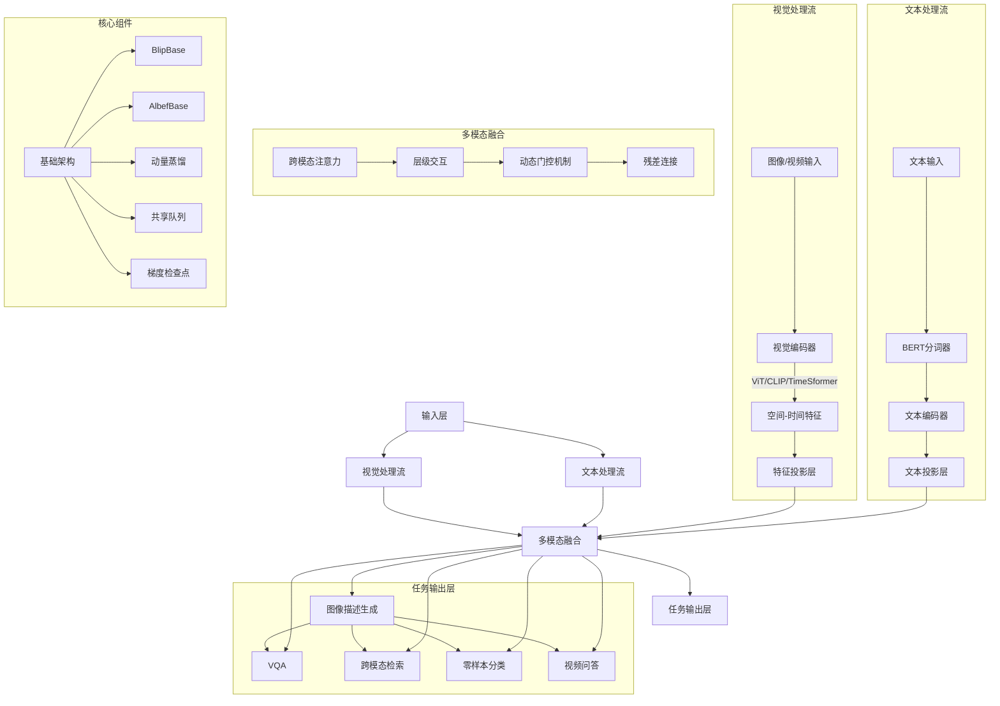
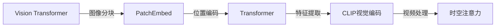
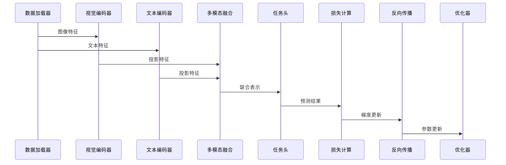
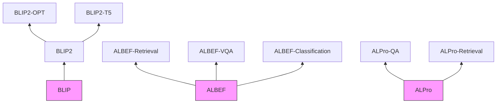
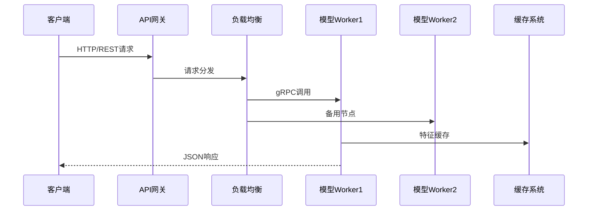

# LAVIS 多模态框架架构解析



## 关键模块说明

### 视觉编码器


### 多模态交互
```python
# 跨模态注意力示例
class CrossAttention(nn.Module):
    def __init__(self, dim, num_heads=8):
        super().__init__()
        self.num_heads = num_heads
        self.scale = dim ** -0.5
        self.q = nn.Linear(dim, dim)
        self.kv = nn.Linear(dim, dim*2)
        
    def forward(self, x, context):
        B, N, C = x.shape
        q = self.q(x).reshape(B, N, self.num_heads, C//self.num_heads).permute(0,2,1,3)
        kv = self.kv(context).reshape(B, -1, 2, self.num_heads, C//self.num_heads).permute(2,0,3,1,4)
        k, v = kv[0], kv[1]
        attn = (q @ k.transpose(-2,-1)) * self.scale
        attn = attn.softmax(dim=-1)
        x = (attn @ v).transpose(1,2).reshape(B,N,C)
        return x
```

## 训练架构



## 模型扩展架构



## 典型配置示例

```yaml
model:
  type: blip2_opt
  vit_model: eva_clip_g
  img_size: 224
  num_query_token: 32
  opt_model: facebook/opt-2.7b
  freeze_vit: true
  prompt: "Question: {} Answer:"
  max_txt_len: 64
  use_grad_checkpoint: true
```

## 性能优化策略


## 服务部署架构



架构图关键特性：
1. 统一的多模态处理管道设计
2. 支持多种视觉编码器（ViT/CLIP/TimeSformer）
3. 灵活的任务扩展接口
4. 生产级服务部署方案
5. 自动混合精度训练支持

建议结合代码文件查看具体实现：
- `lavis/models/blip_models/` BLIP系列核心实现
- `lavis/models/albef_models/` ALBEF对比学习架构
- `lavis/processors/` 多模态数据预处理
- `lavis/tasks/` 多任务训练逻辑
- `app/` 端到端应用示例 