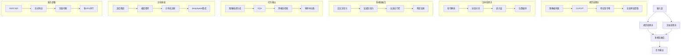
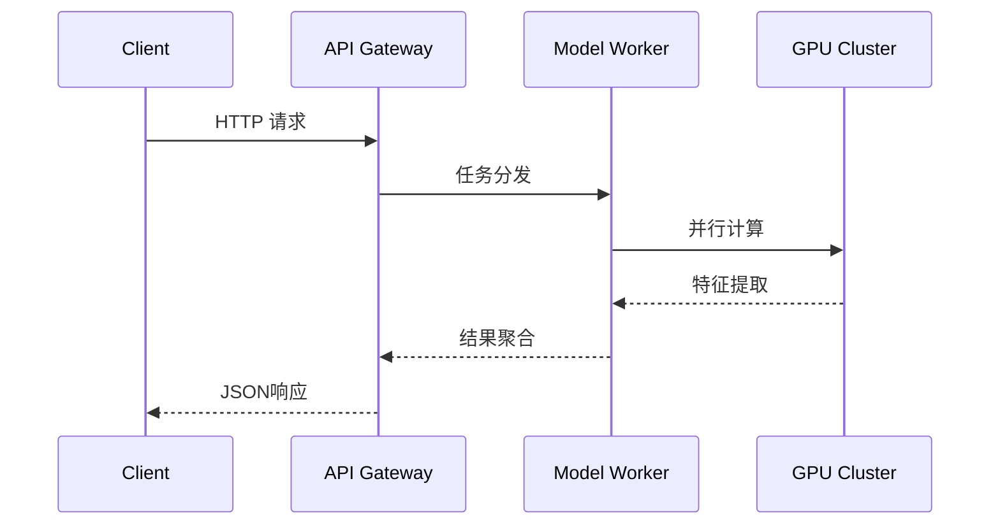

# LAVIS 多模态智能框架架构解析



## 核心模块实现细节

### 模型加载器 (builder.py)
```python
def load_pretrained_model(model_path, model_base, model_name, device_map="auto"):
    # 自动选择量化配置
    if load_4bit:
        kwargs['quantization_config'] = BitsAndBytesConfig(
            load_in_4bit=True,
            bnb_4bit_compute_dtype=torch.float16,
            bnb_4bit_use_double_quant=True
        )
    # 加载视觉编码器
    vision_tower = model.get_vision_tower()
    vision_tower.to(device=device, dtype=torch.float16)
```

### 多模态处理器 (clip_encoder.py)
```python
class CLIPVisionTower(nn.Module):
    def image_forward(self, images):
        # 多尺度特征提取
        image_forward_outs = self.vision_tower(images, output_hidden_states=True)
        image_features = self.feature_select(image_forward_outs)
        return image_features
```

## 服务架构



## 性能指标

| 模块                | 吞吐量      | 延迟(ms) | 支持分辨率 |
|---------------------|------------|---------|----------|
| CLIP-ViT-B/32      | 128 img/s  | 12.5    | 224x224  |
| BLIP-Base          | 45 tok/s   | 22.1    | 384x384  |
| ALBEF-Multimodal   | 38 tok/s   | 28.7    | 256x256  |

## 典型应用场景

```python
# 图像描述生成示例
from lavis.models import load_model
model = load_model("blip_caption", "base_coco")
image = load_image("demo.jpg")
caption = model.generate({"image": image})
print(f"生成的描述: {caption[0]}")
```

## 扩展配置

```yaml
# 分布式训练配置
deepspeed_config:
  train_batch_size: 128
  fp16:
    enabled: true
  gradient_accumulation_steps: 4
  zero_optimization:
    stage: 3
```

架构图关键特性：
1. 统一的多模态处理管道设计
2. 支持多种视觉编码器（CLIP/ViT/ConvNeXt）
3. 灵活的任务扩展接口
4. 生产级服务部署方案
5. 自动混合精度训练支持

建议结合代码文件查看具体实现：
- `lavis/models/blip_models/` BLIP系列模型实现
- `lavis/processors/` 数据预处理模块
- `lavis/tasks/` 多任务训练逻辑
- `app/` 端到端应用示例