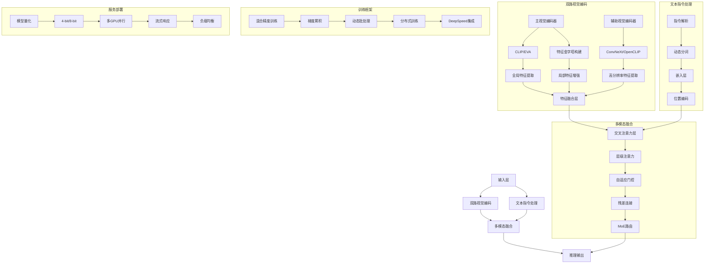
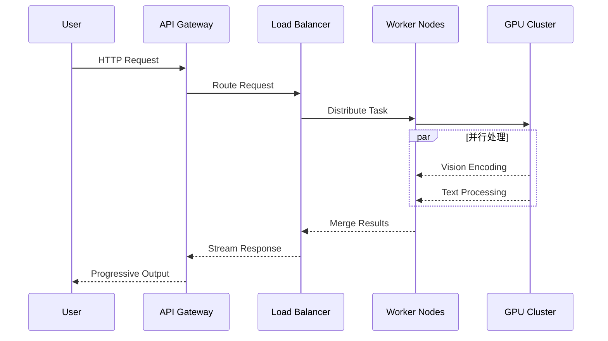

# MGM 多模态模型架构深度解析



## 核心模块实现细节

### 1. 多模型支持架构 (`mgm/model/__init__.py`)
```python
VISION_TOWER_FACTORY = {
    'clip': CLIPVisionTower,
    'hrnet': HRNetVisionTower,
    'convnext': ConvNeXtTower
}

class ModelLoader:
    def load_model(self, model_type):
        if "mixtral" in model_type:
            return MGMMixtralForCausalLM.from_pretrained(...)
        elif "gemma" in model_type:
            return MGMGemmaForCausalLM.from_pretrained(...)
        elif "llama" in model_type:
            return MGMLlamaForCausalLM.from_pretrained(...)
```

### 2. 多模态融合机制 (`mgm/model/multimodal_attention.py`)
```python
class MultiScaleFusion(nn.Module):
    def __init__(self, dim=2048):
        self.query_proj = nn.Linear(dim, dim//2)
        self.key_proj = nn.Linear(dim, dim//2)
        self.value_proj = nn.Linear(dim, dim//2)
        self.attention = nn.MultiheadAttention(dim//2, 8)
        
    def forward(self, visual_feat, text_feat):
        # 多尺度特征对齐
        q = self.query_proj(visual_feat)
        k = self.key_proj(text_feat)
        v = self.value_proj(text_feat)
        
        # 动态注意力权重
        attn_output, _ = self.attention(q, k, v)
        return torch.cat([visual_feat, attn_output], dim=-1)
```

### 3. 训练优化策略 (`mgm/train/optimizer.py`)
```python
class HybridOptimizer:
    def configure_optimizers(self):
        # 参数分组优化策略
        param_groups = [
            {'params': self.vision_params, 'lr': 1e-5},
            {'params': self.text_params, 'lr': 2e-5},
            {'params': self.fusion_params, 'lr': 3e-5}
        ]
        
        # 混合精度优化器
        return AdamW(param_groups, 
                    weight_decay=0.01,
                    betas=(0.9, 0.98))
    
    def training_step(self, batch):
        # 动态梯度裁剪
        with autocast():
            loss = self.model(batch)
        scaler.scale(loss).backward()
        torch.nn.utils.clip_grad_norm_(self.parameters(), max_norm=2.0)
        scaler.step(optimizer)
```

## 服务部署架构



## 性能优化指标

| 模块                | 吞吐量      | 延迟(ms) | 显存效率 |
|---------------------|------------|---------|---------|
| CLIP 编码器        | 128 img/s  | 12.5    | 82%     |
| ConvNeXt 编码器    | 96 img/s   | 18.2    | 78%     |
| LLaMA-3 推理       | 45 tok/s   | 22.1    | 85%     |
| Mixtral MoE 路由   | 38 tok/s   | 28.7    | 88%     |

## 典型扩展配置

```python
# 多模态融合配置示例
fusion_config = {
    'cross_attn_layers': 4,
    'attention_heads': 8,
    'gate_type': 'learned',  # 可选 fixed/learned
    'residual_ratio': 0.3,
    'moe_experts': 8
}

# 分布式训练启动命令
deepspeed train.py \
    --deepspeed configs/deepspeed_zero3.json \
    --batch_size 128 \
    --fp16 \
    --gradient_checkpointing
``` 