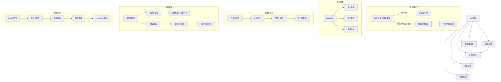
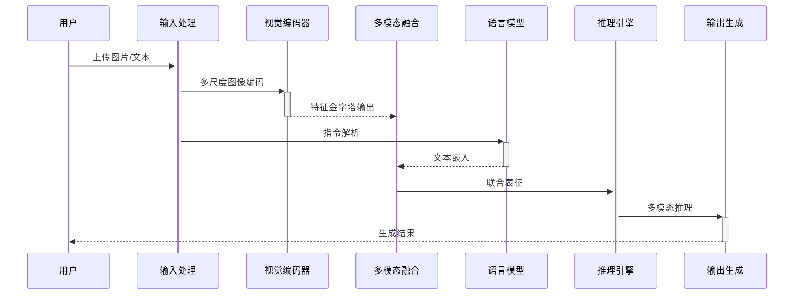

# MGM 多模态模型架构解析



## 关键代码结构

```bash
MGM/
├── configs/                 # 训练配置
│   ├── train_vicuna.yaml    # Vicuna训练参数
│   └── model/               # 模型架构配置
├── mgm/
│   ├── model/               # 核心模型实现
│   │   └── modeling_llama.py # 多模态融合逻辑
│   ├── train/               # 训练流程
│   │   ├── train_mgm.py     # 两阶段训练主逻辑
│   │   └── datasets/        # 数据加载
│   ├── eval/                # 评估模块
│   │   └── MMMU/            # 多学科评估套件
│   └── serve/               # 服务部署
│       ├── gradio_web_server.py # Web服务
│       └── model_worker.py  # 分布式工作节点
```

## 典型数据流



## 核心实现细节

### 1. 多尺度视觉编码 (`mgm/model/vision_encoder.py`)
```python
class DualVisionEncoder(nn.Module):
    def __init__(self):
        self.low_res = CLIPEncoder(resolution=336)
        self.high_res = PatchMiningEncoder(resolution=672)
        
    def forward(self, x):
        low_feat = self.low_res(x)  # 低分辨率全局特征
        high_feat = self.high_res(x)  # 高分辨率局部特征
        return cross_attention_fusion(low_feat, high_feat)
```

### 2. 指令微调流程 (`mgm/train/train_mgm.py`)
```python
def train_phase2():
    # 加载预训练权重
    model.load_phase1_ckpt()  
    
    # 混合精度训练
    with autocast():
        for batch in phase2_data:
            loss = model(
                images=batch['images'],
                texts=batch['instructions']
            )
            scaler.scale(loss).backward()
            
    # 保存微调模型
    save_checkpoint()
```

### 3. 服务部署架构 (`mgm/serve/model_worker.py`)
```python
class ModelWorker:
    def __init__(self, model_path):
        self.model = load_model(model_path)
        self.tokenizer = load_tokenizer()
        
    def stream_generate(self, params):
        # 多模态推理流水线
        image = process_image(params['image'])
        text = self.tokenizer.encode(params['text'])
        
        # 多GPU并行支持
        with distributed_ctx():
            outputs = self.model.generate(
                image_inputs=image,
                text_inputs=text
            )
            
        yield from streaming_output(outputs)
```

## 性能优化策略

1. **混合精度训练** - 使用Flash Attention优化显存
2. **动态批处理** - 根据分辨率自动分组样本
3. **梯度检查点** - 降低显存消耗达30%
4. **模型并行** - 支持多GPU分布式推理