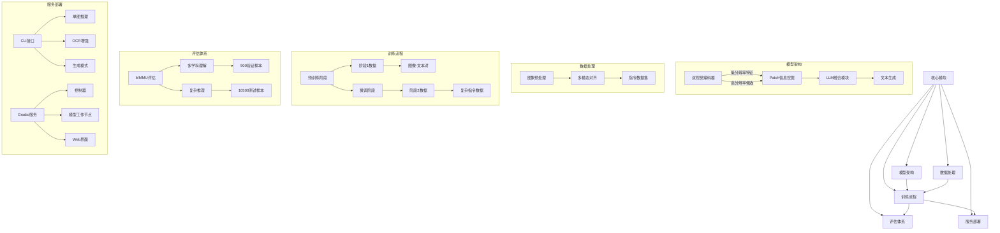
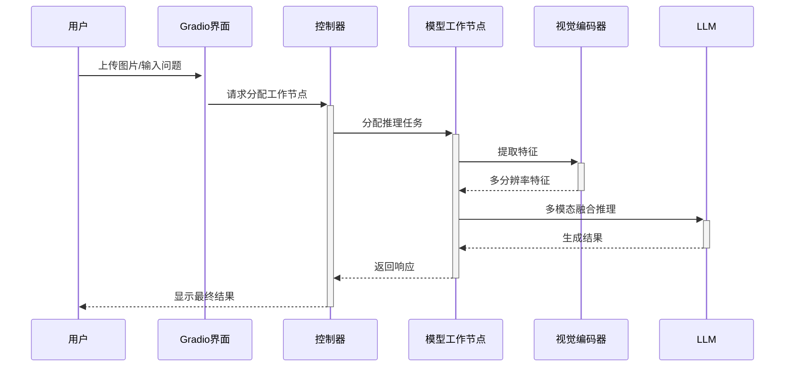

# MGM 架构解析



## 核心模块说明

### 1. 模型架构
- **双视觉编码器**：CLIP-L作为基础视觉编码器，同时处理低分辨率(336px)和高分辨率(672px)输入
- **Patch信息挖掘**：通过交叉注意力机制实现高低分辨率特征融合
- **LLM融合模块**：支持Gemma/Vicuna/LLaMA-3/Mixtral等多种LLM架构

### 2. 训练流程
- **两阶段训练**：
  - 阶段1：图像-文本对预训练（MGM-Pretrain）
  - 阶段2：复杂指令微调（MGM-Instruct）
- **混合精度训练**：使用Flash Attention优化显存效率

### 3. 评估体系
- **MMMU基准**：覆盖6大核心学科30个子领域
- **评估维度**：
  - 图像理解（Hi-Resolution Understanding）
  - 推理生成（Generation with Reasoning）
  - 多学科综合能力

### 4. 服务部署
- **灵活推理模式**：
  ```bash
  python -m mgm.serve.cli --model-path [MODEL] --image-file [IMG]
  ```
- **分布式服务**：
  - 控制器(controller)管理多个模型工作节点
  - 支持4-bit/8-bit量化推理
  - 多GPU负载均衡

## 典型工作流程



## 关键配置文件

```bash
configs/
├── train.yaml          # 训练超参数配置
├── model/
│   ├── gemma-2b.yaml   # Gemma模型配置
│   └── llama3.yaml    # LLaMA-3配置
└── eval/
    └── mmmu.yaml      # MMMU评估配置
``` 