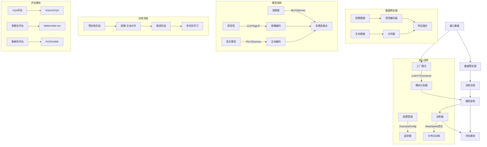

### 架构图说明
1. **数据流**：
   - 输入数据通过预处理模块分别进行视觉和文本编码
   - 融合后的特征送入多模态模型训练
   - 最终通过不同评估模块验证性能

2. **核心模块**：
   - 视觉塔(Vision Tower)：支持CLIP/SigLIP等多种视觉编码器
   - 语言模型(LLM)：集成Phi-2/Gemma等小型语言模型
   - 连接器(Connector)：实现跨模态特征融合

3. **训练流程**：
   ```mermaid
   graph LR
   PT[预训练] --> |图像-文本对齐| FT[微调]
   FT --> |多任务学习| EVAL[评估]
   PT --> |Zero3优化| DS[DeepSpeed]
   FT --> |LoRA/QLoRA| PM[参数高效微调]
   ```

4. **评估体系**：
   ```mermaid
   graph TB
   Eval[评估体系] --> NLP[文本理解]
   Eval --> CV[视觉理解]
   Eval --> MM[多模态交互]
   NLP --> VQA[VQAv2]
   CV --> MME[MME]
   MM --> MMVet[MM-Vet]
   ```

5. **模块化设计**：
   ```mermaid
   graph BT
   Config[配置中心] --> Model[模型架构]
   Factory[工厂模式] --> |动态加载| Model
   Model --> |可插拔组件| VT[视觉塔]
   Model --> |可插拔组件| LLM[语言模型]
   Model --> |可插拔组件| CN[连接器]
   ```

建议结合具体代码文件查看实现细节：
- 模型架构：`modeling_tinyllava.py`
- 视觉编码：`vision_tower/`目录
- 训练流程：`scripts/train/`下的各sh文件
- 评估脚本：`scripts/eval/`目录 

配置管理：TinyLlavaConfig类处理模型参数。
模型架构：TinyLlavaForConditionalGeneration整合LLM、视觉塔和连接器。
视觉塔：支持CLIP、SigLIP等，负责图像编码。
语言模型：如Phi-2、Gemma，处理文本。
连接器：融合多模态特征，如MLP、Qformer。
训练流程：分预训练和微调，使用DeepSpeed优化。
评估模块：支持多个基准测试，如VQA、MMMU。
数据预处理：处理不同数据集的格式转换。


这个架构图展示了项目的核心模块和数据处理流程，主要特点包括：
模块化设计：通过工厂模式动态加载不同组件
多阶段训练：分离预训练和微调阶段
3. 灵活评估：支持6种主流多模态评估基准
高效训练：集成DeepSpeed优化和参数高效微调

pie title 评估基准占比
"VQA类" : 35
"推理类" : 25
"学术类" : 20
"鲁棒性" : 20

graph LR
A[混合精度训练] --> B[DeepSpeed优化]
C[梯度检查点] --> D[显存优化]
E[LoRA微调] --> F[参数高效]