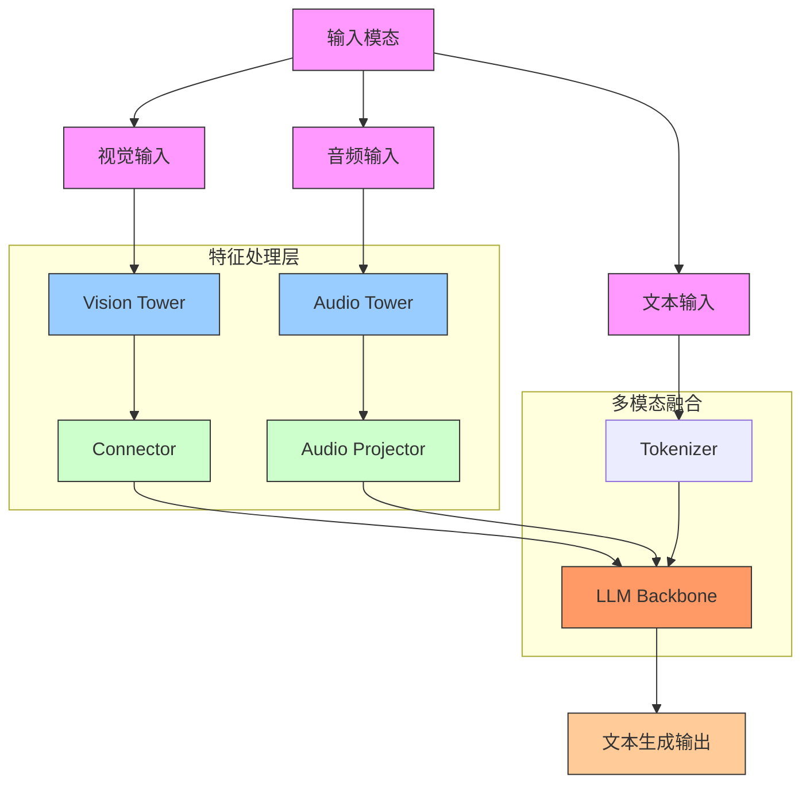
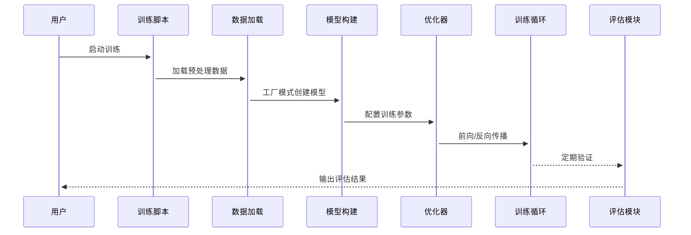
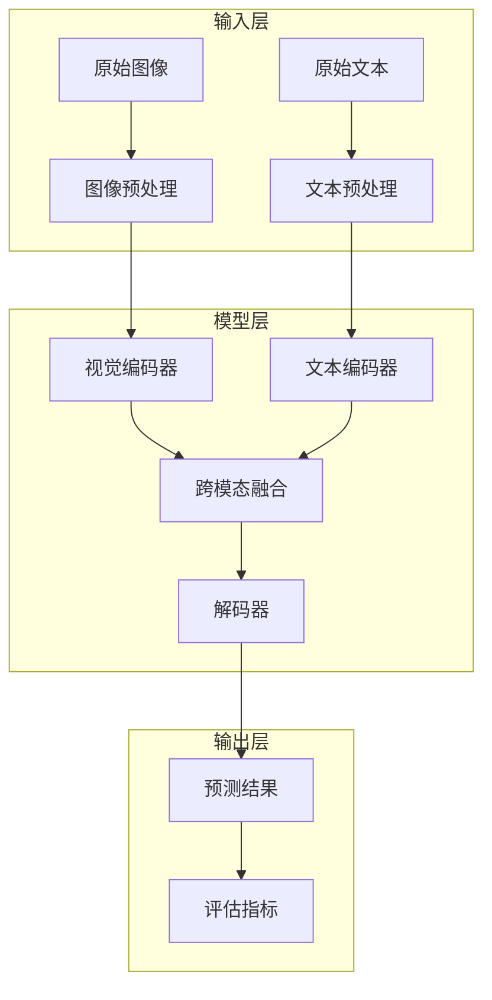
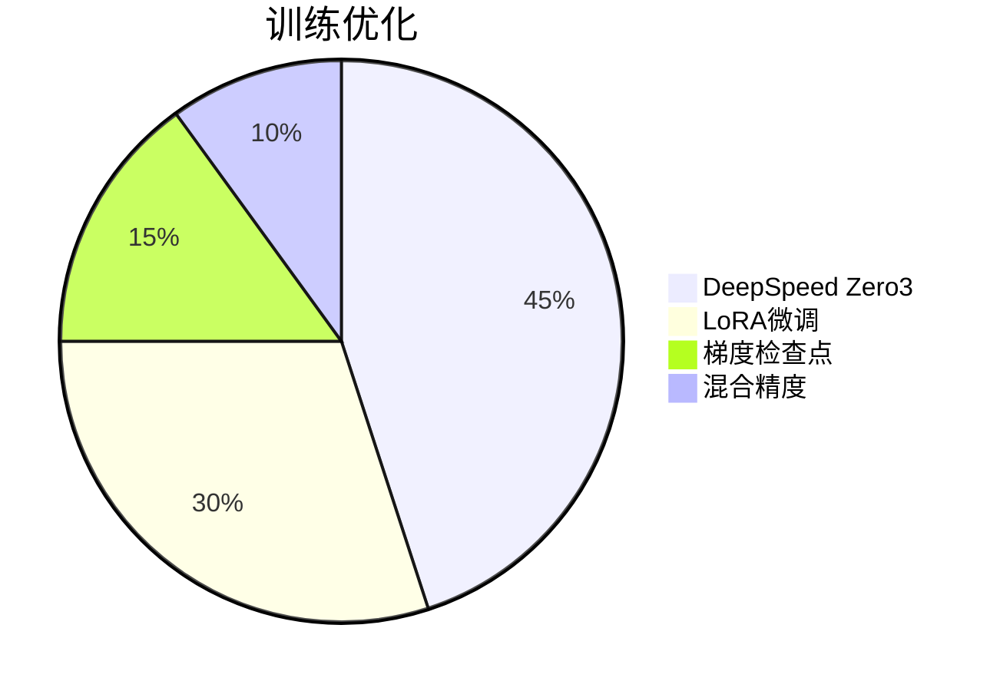
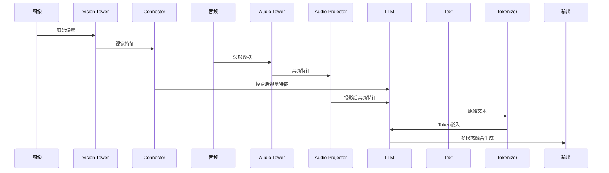
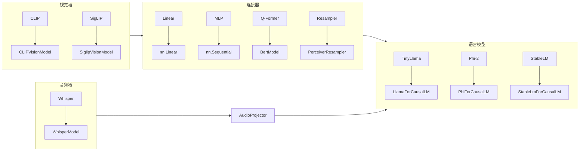
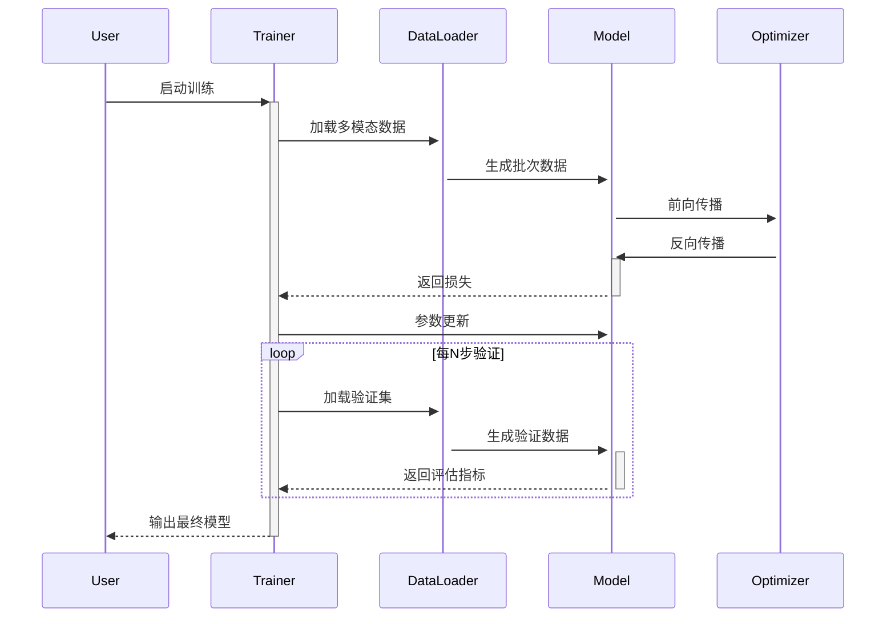
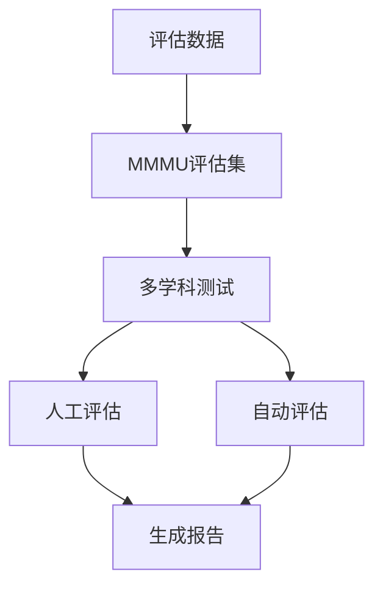

❤️ Community efforts

* Our codebase is built upon the [LLaVA](https://github.com/haotian-liu/LLaVA) project. Great work!
* Our project uses data from the [ShareGPT4V](https://github.com/InternLM/InternLM-XComposer/tree/main/projects/ShareGPT4V) project. Great work!



### 架构说明

#### 数据流

1. **输入处理**：
   
   - 图像通过视觉编码器(CLIP/SigLIP)提取特征
   - 文本通过分词器(Tokenizer)转换为token
   - 特征融合模块将多模态特征对齐
   
2. **模型训练**：
   ```mermaid
   graph LR
   PT[预训练] --> |图像-文本匹配| FT[微调]
   FT --> |多任务学习| EVAL[评估]
   PT --> |Zero3优化| DS[DeepSpeed]
   FT --> |LoRA/QLoRA| PE[参数高效微调]
   ```

3. **核心模块**：
   ```mermaid
   graph TB
   Model[模型架构] --> VT[视觉塔]
   Model --> LLM[语言模型]
   Model --> CN[连接器]
   Config[配置中心] --> Model
   Factory[工厂模式] --> Model
   ```

#### 关键目录说明
| 目录/文件                | 功能描述                                                                 |
|-------------------------|--------------------------------------------------------------------------|
| `scripts/train/`        | 训练脚本，支持全参数微调/LoRA/QLoRA                                     |
| `scripts/eval/`         | 评估脚本，覆盖6大主流多模态基准                                         |
| `tinyllava/model/`      | 模型实现，包含视觉塔/语言模型/连接器                                     |
| `tinyllava/data/`       | 数据处理，支持图像/文本预处理和数据集加载                               |
| `tinyllava/train/`      | 训练核心逻辑，包含DeepSpeed优化和梯度检查点                             |
| `tinyllava/eval/`       | 评估指标实现，包含VQA/TextVQA/MMMU等评估器                              |

#### 典型训练流程



#### 模块交互关系



建议结合代码文件理解实现细节：
- 模型架构：`modeling_tinyllava.py`
- 视觉编码：`vision_tower/clip.py` 和 `vision_tower/siglip.py`
- 训练流程：`train/train.py`
- 评估逻辑：`eval/model_vqa*.py` 系列文件










训练流程示意图：



该架构图反映了以下代码设计特点：

1. 模块化设计：

```python
# 示例：Vision Tower工厂模式
def VisionTowerFactory(name):
    for model in VISION_TOWER_FACTORY:
        if model in name.lower():
            return VISION_TOWER_FACTORY[model]()
```

2.动态特征处理：

```python
# Connector模块选择
class LinearConnector(Connector):
    def __init__(self, config):
        self._connector = nn.Linear(...)
```

3.多模态融合：

```python
# modeling_tinyllava.py
def forward(...):
    visual_features = self.connector(vision_output)
    audio_features = self.audio_projector(audio_output)
    inputs_embeds = torch.cat([text_embeds, visual_features, audio_features], dim=1)
```

建议结合以下代码文件理解架构：

modeling_tinyllava.py: 主模型架构

vision_tower/: 视觉特征提取

connector/: 跨模态特征投影

llm/: 语言模型实现

audio_tower/: 音频处理模块

```

### 评估流程




