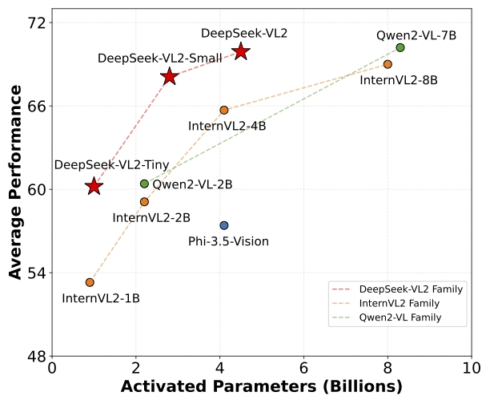

<!-- markdownlint-disable first-line-h1 -->
<!-- markdownlint-disable html -->
<!-- markdownlint-disable no-duplicate-header -->

<div align="center">
  
</div>
<hr>
<div align="center">

  <a href="https://www.deepseek.com/" target="_blank">
    
  </a>
  <a href="https://huggingface.co/spaces/deepseek-ai/deepseek-vl2-small" target="_blank">
    
  </a>
  <a href="https://huggingface.co/deepseek-ai" target="_blank">
    
  </a>

</div>


<div align="center">

  <a href="https://discord.gg/Tc7c45Zzu5" target="_blank">
    
  </a>
  <a href="images/qr.jpeg" target="_blank">
    
  </a>
  <a href="https://twitter.com/deepseek_ai" target="_blank">
    
  </a>

</div>

<div align="center">

  <a href="LICENSE-CODE">
    
  </a>
  <a href="LICENSE-MODEL">
    
  </a>
</div>


<p align="center">
  <a href="https://github.com/deepseek-ai/DeepSeek-VL2/tree/main?tab=readme-ov-file#3-model-download"><b>📥 Model Download</b></a> |
  <a href="https://github.com/deepseek-ai/DeepSeek-VL2/tree/main?tab=readme-ov-file#4-quick-start"><b>⚡ Quick Start</b></a> |
  <a href="https://github.com/deepseek-ai/DeepSeek-VL2/tree/main?tab=readme-ov-file#5-license"><b>📜 License</b></a> |
  <a href="https://github.com/deepseek-ai/DeepSeek-VL2/tree/main?tab=readme-ov-file#6-citation"><b>📖 Citation</b></a> <br>
  <a href="./DeepSeek_VL2_paper.pdf"><b>📄 Paper Link</b></a> |
  <a href="https://arxiv.org/abs/2412.10302"><b>📄 Arxiv Paper Link</b></a> |
  <a href="https://huggingface.co/spaces/deepseek-ai/deepseek-vl2-small"><b>👁️ Demo</b></a>
</p>

## 1. Introduction

Introducing DeepSeek-VL2, an advanced series of large Mixture-of-Experts (MoE) Vision-Language Models that significantly improves upon its predecessor, DeepSeek-VL. DeepSeek-VL2 demonstrates superior capabilities across various tasks, including but not limited to visual question answering, optical character recognition,  document/table/chart understanding, and visual grounding. Our model series is composed of three variants: DeepSeek-VL2-Tiny, DeepSeek-VL2-Small and DeepSeek-VL2, with 1.0B, 2.8B and 4.5B activated parameters respectively.
DeepSeek-VL2 achieves competitive or state-of-the-art performance with similar or fewer activated parameters compared to existing open-source dense and MoE-based models.


[DeepSeek-VL2: Mixture-of-Experts Vision-Language Models for Advanced Multimodal Understanding]()

Zhiyu Wu*, Xiaokang Chen*, Zizheng Pan*, Xingchao Liu*, Wen Liu**, Damai Dai, Huazuo Gao, Yiyang Ma, Chengyue Wu, Bingxuan Wang, Zhenda Xie, Yu Wu, Kai Hu, Jiawei Wang, Yaofeng Sun, Yukun Li, Yishi Piao, Kang Guan, Aixin Liu, Xin Xie, Yuxiang You, Kai Dong, Xingkai Yu, Haowei Zhang, Liang Zhao, Yisong Wang, Chong Ruan*** (* Equal Contribution, ** Project Lead, *** Corresponding author)



## 2. Release
✅ <b>2025-2-6</b>: Naive Implemented Gradio Demo on Huggingface Space [deepseek-vl2-small](https://huggingface.co/spaces/deepseek-ai/deepseek-vl2-small).

✅ <b>2024-12-25</b>: Gradio Demo Example, Incremental Prefilling and VLMEvalKit Support.

✅ <b>2024-12-13</b>: DeepSeek-VL2 family released, including <code>DeepSeek-VL2-tiny</code>, <code>DeepSeek-VL2-small</code>, <code>DeepSeek-VL2</code>.

## 3. Model Download

We release the DeepSeek-VL2 family, including <code>DeepSeek-VL2-tiny</code>, <code>DeepSeek-VL2-small</code>, <code>DeepSeek-VL2</code>.
To support a broader and more diverse range of research within both academic and commercial communities.
Please note that the use of this model is subject to the terms outlined in [License section](#5-license).

### Huggingface

| Model        | Sequence Length | Download                                                                    |
|--------------|-----------------|-----------------------------------------------------------------------------|
| DeepSeek-VL2-tiny | 4096            | [🤗 Hugging Face](https://huggingface.co/deepseek-ai/deepseek-vl2-tiny) |
| DeepSeek-VL2-small | 4096            | [🤗 Hugging Face](https://huggingface.co/deepseek-ai/deepseek-vl2-small) |
| DeepSeek-VL2 | 4096            | [🤗 Hugging Face](https://huggingface.co/deepseek-ai/deepseek-vl2)   |


## 4. Quick Start

### Installation

On the basis of `Python >= 3.8` environment, install the necessary dependencies by running the following command:

```shell
pip install -e .
```

### Simple Inference Example with One Image

**Note: You may need 80GB GPU memory to run this script with deepseek-vl2-small and even larger for deepseek-vl2.**

```python
import torch
from transformers import AutoModelForCausalLM

from deepseek_vl2.models import DeepseekVLV2Processor, DeepseekVLV2ForCausalLM
from deepseek_vl2.utils.io import load_pil_images


# specify the path to the model
model_path = "deepseek-ai/deepseek-vl2-tiny"
vl_chat_processor: DeepseekVLV2Processor = DeepseekVLV2Processor.from_pretrained(model_path)
tokenizer = vl_chat_processor.tokenizer

vl_gpt: DeepseekVLV2ForCausalLM = AutoModelForCausalLM.from_pretrained(model_path, trust_remote_code=True)
vl_gpt = vl_gpt.to(torch.bfloat16).cuda().eval()

## single image conversation example
## Please note that <|ref|> and <|/ref|> are designed specifically for the object localization feature. These special tokens are not required for normal conversations.
## If you would like to experience the grounded captioning functionality (responses that include both object localization and reasoning), you need to add the special token <|grounding|> at the beginning of the prompt. Examples could be found in Figure 9 of our paper.
conversation = [
    {
        "role": "<|User|>",
        "content": "<image>\n<|ref|>The giraffe at the back.<|/ref|>.",
        "images": ["./images/visual_grounding_1.jpeg"],
    },
    {"role": "<|Assistant|>", "content": ""},
]

# load images and prepare for inputs
pil_images = load_pil_images(conversation)
prepare_inputs = vl_chat_processor(
    conversations=conversation,
    images=pil_images,
    force_batchify=True,
    system_prompt=""
).to(vl_gpt.device)

# run image encoder to get the image embeddings
inputs_embeds = vl_gpt.prepare_inputs_embeds(**prepare_inputs)

# run the model to get the response
outputs = vl_gpt.language.generate(
    inputs_embeds=inputs_embeds,
    attention_mask=prepare_inputs.attention_mask,
    pad_token_id=tokenizer.eos_token_id,
    bos_token_id=tokenizer.bos_token_id,
    eos_token_id=tokenizer.eos_token_id,
    max_new_tokens=512,
    do_sample=False,
    use_cache=True
)

answer = tokenizer.decode(outputs[0].cpu().tolist(), skip_special_tokens=False)
print(f"{prepare_inputs['sft_format'][0]}", answer)
```

And the output is something like:
```
<|User|>: <image>
<|ref|>The giraffe at the back.<|/ref|>.

<|Assistant|>: <|ref|>The giraffe at the back.<|/ref|><|det|>[[580, 270, 999, 900]]<|/det|><｜end▁of▁sentence｜>
```

### Simple Inference Example with Multiple Images

**Note: You may need 80GB GPU memory to run this script with deepseek-vl2-small and even larger for deepseek-vl2.**

```python
import torch
from transformers import AutoModelForCausalLM

from deepseek_vl2.models import DeepseekVLV2Processor, DeepseekVLV2ForCausalLM
from deepseek_vl2.utils.io import load_pil_images


# specify the path to the model
model_path = "deepseek-ai/deepseek-vl2-tiny"
vl_chat_processor: DeepseekVLV2Processor = DeepseekVLV2Processor.from_pretrained(model_path)
tokenizer = vl_chat_processor.tokenizer

vl_gpt: DeepseekVLV2ForCausalLM = AutoModelForCausalLM.from_pretrained(model_path, trust_remote_code=True)
vl_gpt = vl_gpt.to(torch.bfloat16).cuda().eval()

# multiple images/interleaved image-text
conversation = [
    {
        "role": "<|User|>",
        "content": "This is image_1: <image>\n"
                   "This is image_2: <image>\n"
                   "This is image_3: <image>\n Can you tell me what are in the images?",
        "images": [
            "images/multi_image_1.jpeg",
            "images/multi_image_2.jpeg",
            "images/multi_image_3.jpeg",
        ],
    },
    {"role": "<|Assistant|>", "content": ""}
]

# load images and prepare for inputs
pil_images = load_pil_images(conversation)
prepare_inputs = vl_chat_processor(
    conversations=conversation,
    images=pil_images,
    force_batchify=True,
    system_prompt=""
).to(vl_gpt.device)

# run image encoder to get the image embeddings
inputs_embeds = vl_gpt.prepare_inputs_embeds(**prepare_inputs)

# run the model to get the response
outputs = vl_gpt.language.generate(
    inputs_embeds=inputs_embeds,
    attention_mask=prepare_inputs.attention_mask,
    pad_token_id=tokenizer.eos_token_id,
    bos_token_id=tokenizer.bos_token_id,
    eos_token_id=tokenizer.eos_token_id,
    max_new_tokens=512,
    do_sample=False,
    use_cache=True
)

answer = tokenizer.decode(outputs[0].cpu().tolist(), skip_special_tokens=False)
print(f"{prepare_inputs['sft_format'][0]}", answer)
```

And the output is something like:
```
<|User|>: This is image_1: <image>
This is image_2: <image>
This is image_3: <image>
 Can you tell me what are in the images?

<|Assistant|>: The images show three different types of vegetables. Image_1 features carrots, which are orange with green tops. Image_2 displays corn cobs, which are yellow with green husks. Image_3 contains raw pork ribs, which are pinkish-red with some marbling.<｜end▁of▁sentence｜>
```

### Simple Inference Example with Incremental Prefilling

**Note: We use incremental prefilling to inference within 40GB GPU using deepseek-vl2-small.**

```python
import torch
from transformers import AutoModelForCausalLM

from deepseek_vl2.models import DeepseekVLV2Processor, DeepseekVLV2ForCausalLM
from deepseek_vl2.utils.io import load_pil_images


# specify the path to the model
model_path = "deepseek-ai/deepseek-vl2-small"
vl_chat_processor: DeepseekVLV2Processor = DeepseekVLV2Processor.from_pretrained(model_path)
tokenizer = vl_chat_processor.tokenizer

vl_gpt: DeepseekVLV2ForCausalLM = AutoModelForCausalLM.from_pretrained(model_path, trust_remote_code=True)
vl_gpt = vl_gpt.to(torch.bfloat16).cuda().eval()

# multiple images/interleaved image-text
conversation = [
    {
        "role": "<|User|>",
        "content": "This is image_1: <image>\n"
                   "This is image_2: <image>\n"
                   "This is image_3: <image>\n Can you tell me what are in the images?",
        "images": [
            "images/multi_image_1.jpeg",
            "images/multi_image_2.jpeg",
            "images/multi_image_3.jpeg",
        ],
    },
    {"role": "<|Assistant|>", "content": ""}
]

# load images and prepare for inputs
pil_images = load_pil_images(conversation)
prepare_inputs = vl_chat_processor(
    conversations=conversation,
    images=pil_images,
    force_batchify=True,
    system_prompt=""
).to(vl_gpt.device)

with torch.no_grad():
    # run image encoder to get the image embeddings
    inputs_embeds = vl_gpt.prepare_inputs_embeds(**prepare_inputs)

    # incremental_prefilling when using 40G GPU for vl2-small
    inputs_embeds, past_key_values = vl_gpt.incremental_prefilling(
        input_ids=prepare_inputs.input_ids,
        images=prepare_inputs.images,
        images_seq_mask=prepare_inputs.images_seq_mask,
        images_spatial_crop=prepare_inputs.images_spatial_crop,
        attention_mask=prepare_inputs.attention_mask,
        chunk_size=512 # prefilling size
    )

    # run the model to get the response
    outputs = vl_gpt.generate(
        inputs_embeds=inputs_embeds,
        input_ids=prepare_inputs.input_ids,
        images=prepare_inputs.images,
        images_seq_mask=prepare_inputs.images_seq_mask,
        images_spatial_crop=prepare_inputs.images_spatial_crop,
        attention_mask=prepare_inputs.attention_mask,
        past_key_values=past_key_values,

        pad_token_id=tokenizer.eos_token_id,
        bos_token_id=tokenizer.bos_token_id,
        eos_token_id=tokenizer.eos_token_id,
        max_new_tokens=512,

        do_sample=False,
        use_cache=True,
    )

    answer = tokenizer.decode(outputs[0][len(prepare_inputs.input_ids[0]):].cpu().tolist(), skip_special_tokens=False)

print(f"{prepare_inputs['sft_format'][0]}", answer)
```

And the output is something like:
```
<|User|>: This is image_1: <image>
This is image_2: <image>
This is image_3: <image>
 Can you tell me what are in the images?

<|Assistant|>: The first image contains carrots. The second image contains corn. The third image contains meat.<｜end▁of▁sentence｜>
```

Parse the bounding box coordinates, please refer to [parse_ref_bbox](https://github.com/deepseek-ai/DeepSeek-VL2/blob/main/deepseek_vl2/serve/app_modules/utils.py#L270-L298).


### Full Inference Example
```shell
# without incremental prefilling
CUDA_VISIBLE_DEVICES=0 python inference.py --model_path "deepseek-ai/deepseek-vl2"

# with incremental prefilling, when using 40G GPU for vl2-small
CUDA_VISIBLE_DEVICES=0 python inference.py --model_path "deepseek-ai/deepseek-vl2-small" --chunk_size 512

```


### Gradio Demo

* Install the necessary dependencies:
```shell
pip install -e .[gradio]
```

* then run the following command:

```shell
# vl2-tiny, 3.37B-MoE in total, activated 1B, can be run on a single GPU < 40GB
CUDA_VISIBLE_DEVICES=2 python web_demo.py \
--model_name "deepseek-ai/deepseek-vl2-tiny"  \
--port 37914


# vl2-small, 16.1B-MoE in total, activated 2.4B
# If run on A100 40GB GPU, you need to set the `--chunk_size 512` for incremental prefilling for saving memory and it might be slow.
# If run on > 40GB GPU, you can ignore the `--chunk_size 512` for faster response.
CUDA_VISIBLE_DEVICES=2 python web_demo.py \
--model_name "deepseek-ai/deepseek-vl2-small"  \
--port 37914 \
--chunk_size 512

# # vl27.5-MoE in total, activated 4.2B
CUDA_VISIBLE_DEVICES=2 python web_demo.py \
--model_name "deepseek-ai/deepseek-vl2"  \
--port 37914
```

* **Important**: This is a basic and native demo implementation without any deployment optimizations, which may result in slower performance. For production environments, consider using optimized deployment solutions, such as vllm, sglang, lmdeploy, etc. These optimizations will help achieve faster response times and better cost efficiency.

## 5. License

This code repository is licensed under [MIT License](./LICENSE-CODE). The use of DeepSeek-VL2 models is subject to [DeepSeek Model License](./LICENSE-MODEL). DeepSeek-VL2 series supports commercial use.

## 6. Citation

```
@misc{wu2024deepseekvl2mixtureofexpertsvisionlanguagemodels,
      title={DeepSeek-VL2: Mixture-of-Experts Vision-Language Models for Advanced Multimodal Understanding},
      author={Zhiyu Wu and Xiaokang Chen and Zizheng Pan and Xingchao Liu and Wen Liu and Damai Dai and Huazuo Gao and Yiyang Ma and Chengyue Wu and Bingxuan Wang and Zhenda Xie and Yu Wu and Kai Hu and Jiawei Wang and Yaofeng Sun and Yukun Li and Yishi Piao and Kang Guan and Aixin Liu and Xin Xie and Yuxiang You and Kai Dong and Xingkai Yu and Haowei Zhang and Liang Zhao and Yisong Wang and Chong Ruan},
      year={2024},
      eprint={2412.10302},
      archivePrefix={arXiv},
      primaryClass={cs.CV},
      url={https://arxiv.org/abs/2412.10302},
}
```

## 7. Contact

If you have any questions, please raise an issue or contact us at [service@deepseek.com](mailto:service@deepseek.com).
