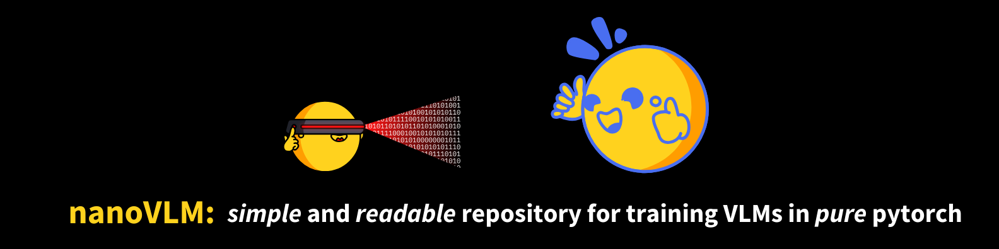
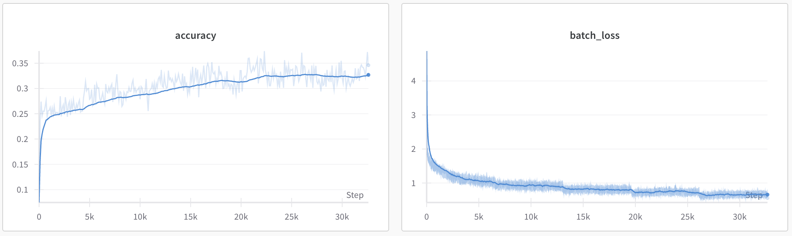

# nanoVLM



<a target="_blank" href="https://colab.research.google.com/github/huggingface/nanoVLM/blob/main/nanoVLM.ipynb">
  
</a>  

nanoVLM is the simplest repository for training/finetuning a small sized Vision-Language Model with a lightweight implementation in pure PyTorch. The code itself is very readable and approachable, the model consists of a Vision Backbone (`models/vision_transformer.py` ~150 lines), Language Decoder (`models/language_model.py` ~250 lines), Modality Projection (`models/modality_projection.py` ~50 lines) and the VLM itself (`models/vision_language_model.py` ~100 lines) and a simple training loop (`train.py` ~200 lines).

Similar to Andrej Karpathy's nanoGPT, we wanted to equip the community with a very simple implementation and training script for Vision Language Models. We do not claim this to be a new SOTA model, rather an educational effort that packs quite a bit of punch if you have the right hardware! You should be able to tweak and play around with the code in no time.


### What can nanoVLM do?
The model definition and training logic of this repository fits in ~750 lines, with some more boilerplate logging and parameter loading. 
Using the [`SigLIP-B/16-224-85M`](https://huggingface.co/google/siglip-base-patch16-224) and [`HuggingFaceTB/SmolLM2-135M`](https://huggingface.co/HuggingFaceTB/SmolLM2-135M) as backbones results in a **222M** nanoVLM. Training this for ~6h on a single H100 GPU on ~1.7M samples of [the cauldron](https://huggingface.co/datasets/HuggingFaceM4/the_cauldron) results in an accuracy of 35.3% on MMStar.



It is therefore a simple but yet powerful platform to get started with VLMs. Perfect to tinker around with different setups and setting, to explore the capabilities and efficiencies of small VLMs!

## Quick Start
You can either clone the repository, setup an environement and start with the scripts, or directly [open in Colab](https://colab.research.google.com/github/huggingface/nanoVLM/blob/main/nanoVLM.ipynb). You can also use the [interactive notebook](./nanoVLM.ipynb) to get started!

## Environment Setup
We really like `uv` and recommend using it as your package manager. But feel free to use any one that you prefer.

Let's first clone the repository:
```bash
git clone https://github.com/huggingface/nanoVLM.git
cd nanoVLM
```

If you want to use `uv`:
```bash
uv init --bare
uv sync --python 3.12
source .venv/bin/activate
uv add torch numpy torchvision pillow datasets huggingface-hub transformers
```

If you prefer another environment manager, simply install these packages:  
```bash
pip install torch numpy torchvision pillow datasets huggingface-hub transformers
```
Dependencies: 
- `torch` <3
- `numpy` <3
- `torchvision` for the image processors
- `pillow` for image loading
- `datasets` for the training datasets
- `huggingface-hub` & `transformers` to load the pretrained backbones

## Training

To train nanoVLM, you can simply use the provided training script
```bash
python train.py
```
which will use the default `models/config.py`.

## Generate

To try a [trained model](https://huggingface.co/lusxvr/nanoVLM-222M), you can simply use the provided generate script
```bash
python generate.py
```

If we feed the example image in `assets/image.png` with a question into the model, we get the following output. Even after only short training, the model can recognize the cat in the picture. 
```
Input: 
Image + 'What is this?'
Output:
Generation 1:  This is a cat sitting on the floor. I think this is a cat sat facing towards the left
Generation 2:  The picture contains a white and brown cat sitting on the floor, platform, it is measuring 1
Generation 3:  This is a cat which is sitting on the floor of the house. This cat wore a black and
Generation 4:  This is a cute cat sitting on the surface of the mat. The background, which is blur,
Generation 5:  This is a cat sitting on a rug, which is on the ground. The cat is in brown
```

## Citation
If you like the project and want to use it somewhere, please use this citation:
```
@misc{wiedmann2025nanovlm,
  author = {Luis Wiedmann and Aritra Roy Gosthipaty and Andrés Marafioti},
  title = {nanoVLM},
  year = {2025},
  publisher = {GitHub},
  journal = {GitHub repository},
  howpublished = {\url{https://github.com/huggingface/nanoVLM}}
}
```
