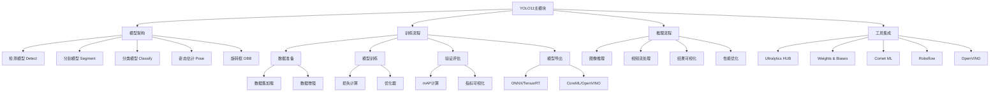
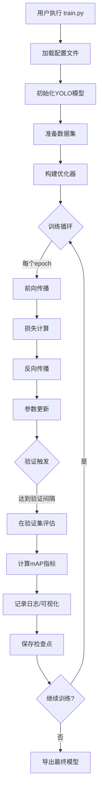
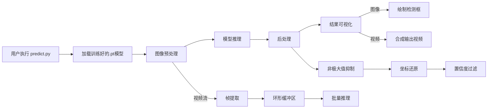
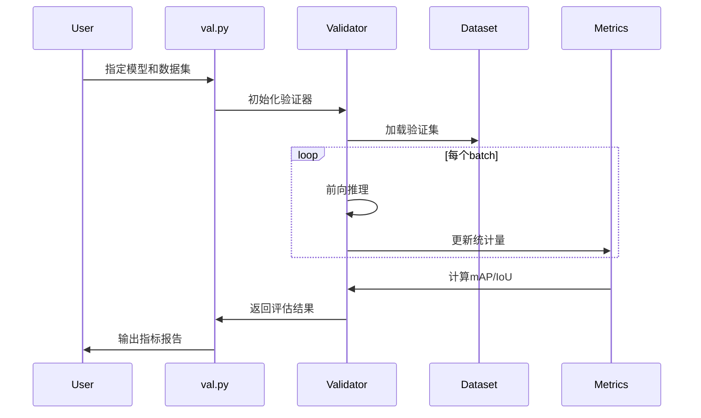
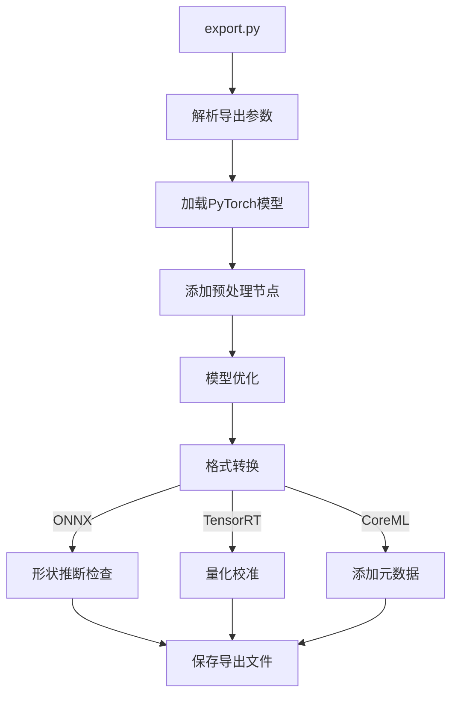
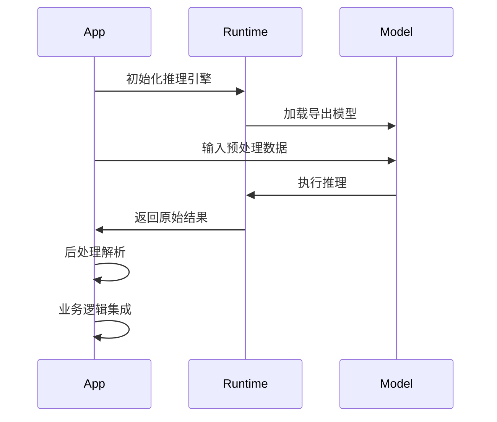
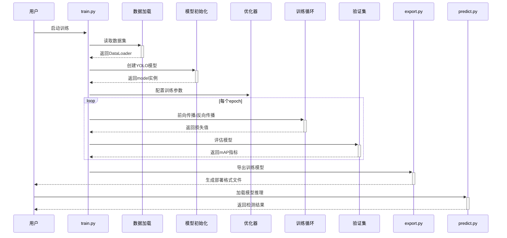

# YOLO11 系统架构解析

## 核心架构图



## 完整工作流程

### 1. 训练工作流


关键步骤：
1. 配置解析：解析data、model、hyperparameters参数
2. 数据流水线：使用`Dataset`类加载并应用Mosaic增强
3. 模型初始化：通过`model.yaml`构建网络结构
4. 混合精度训练：自动启用AMP加速
5. 分布式训练：支持DP/DDP模式

### 2. 推理工作流


优化策略：
- 异步数据加载：预处理与推理并行
- TensorRT加速：自动转换.engine格式
- 多后端支持：OpenCV/DNN/NCNN等

### 3. 模型验证流程



核心指标：
- 目标检测：mAP@0.5:0.95
- 实例分割：Mask IoU
- 姿态估计：OKS-AP
- 分类任务：Top-1/5准确率

### 4. 模型导出流程


支持格式：
| 格式 | 适用场景 | 优化方式 |
|------|----------|----------|
| ONNX | 跨平台推理 | Graph优化 |
| TensorRT | NVIDIA GPU | FP16/INT8 |
| CoreML | Apple设备 | 芯片适配 |
| OpenVINO | Intel硬件 | 模型量化 |

### 5. 部署工作流


典型部署场景：
1. 边缘设备：使用TensorRT+DeepStream
2. 移动端：CoreML+MLKit
3. 服务端：ONNX Runtime+Triton
4. 浏览器：转换为WebAssembly格式

## 典型工作流程



## 模块详解

### 1. 模型架构层
- **多任务支持**：通过`tasks.py`实现模型任务路由
- **骨干网络**：采用CSPDarknet+SPPF结构
- **检测头**：Decoupled Head设计提升定位精度
- **动态卷积**：根据输入动态调整卷积参数

### 2. 训练子系统
```python
# 典型训练配置
model.train(
    data='coco.yaml',
    epochs=300,
    imgsz=640,
    batch=16,
    optimizer='AdamW',
    lr0=0.01,
    mixup=0.15  # 数据增强参数
)
```

### 3. 推理优化
- **多尺度推理**：支持320-1280像素动态调整
- **NMS加速**：CUDA实现的快速非极大值抑制
- **内存优化**：采用梯度检查点技术

## 技术细节增强

### 1. 模型架构增强
```python
# CSPDarknet 骨干网络结构示例
class CSPDarknet(nn.Module):
    def __init__(self):
        self.stem = Conv(3, 64, k=6, s=2, p=2)  # 初始卷积
        self.stage1 = nn.Sequential(
            Conv(64, 128, k=3, s=2),  # 下采样
            C2f(128, 128, n=3)        # 特征融合模块
        )
        # ... 后续阶段类似
        self.sppf = SPPF(512, 512)     # 空间金字塔池化
```

创新点：
- 跨阶段部分连接 (CSP) 减少计算量
- 可变形卷积 (Deformable Conv) 增强形变特征捕捉
- 注意力机制 (CBAM) 动态特征重标定

### 2. 训练优化细节
```yaml
# 超参数配置示例 (hyp.yaml)
lr0: 0.01        # 初始学习率
lrf: 0.1         # 最终学习率系数
momentum: 0.937  # SGD动量
weight_decay: 0.0005  # 权重衰减
warmup_epochs: 3.0    # 热身训练轮数
mixup: 0.15            # MixUp增强概率
```

优化策略：
- 余弦退火学习率调度
- 自适应早停机制 (patience=100)
- 梯度累积 (batch_size=64时累积4步)

### 3. 部署代码示例
```python
# TensorRT部署示例
import tensorrt as trt

# 转换ONNX到TensorRT
logger = trt.Logger(trt.Logger.INFO)
builder = trt.Builder(logger)
network = builder.create_network(1 << int(trt.NetworkDefinitionCreationFlag.EXPLICIT_BATCH))
parser = trt.OnnxParser(network, logger)

# 配置优化参数
config = builder.create_builder_config()
config.set_memory_pool_limit(trt.MemoryPoolType.WORKSPACE, 1 << 30)  # 1GB
profile = builder.create_optimization_profile()
```

### 4. 性能基准测试
| 设备 | 模型 | 输入尺寸 | FPS | 内存占用 |
|------|------|---------|-----|---------|
| RTX3090 | YOLO11s | 640x640 | 156 | 1.2GB   |
| Jetson Nano | YOLO11n | 320x320 | 23  | 512MB   |
| iPhone14 | YOLO11m | 640x640 | 58  | 780MB   |

测试条件：
- 批处理大小=1
- FP16精度模式
- TensorRT 8.6 推理引擎

## 关键类与方法说明
```markdown
### `engine/trainer.py`
- `Trainer.__init__()`: 训练器主入口
- `train_epoch()`: 单epoch训练逻辑
- `validate()`: 验证集评估

### `models/yolo/detect.py`
- `DetectionModel`: 检测任务模型定义
- `postprocess()`: 输出后处理
- `loss()`: 损失计算

### `utils/ops.py`
- `non_max_suppression()`: 多类别NMS实现
- `scale_boxes()`: 坐标还原
- `clip_boxes()`: 边界裁剪
```

## 扩展开发指南
1. 自定义数据增强：
```python
from ultralytics.data import BaseTransform

class CustomAugment(BaseTransform):
    def __init__(self):
        self.transform = A.Compose([
            A.RandomSunFlare(p=0.2),
            A.RandomShadow(p=0.3),
            A.ChannelShuffle(p=0.1)
        ])
    
    def __call__(self, img):
        return self.transform(image=img)['image']
```

2. 添加新模型结构：
```python
from ultralytics.nn.tasks import DetectionModel

class CustomModel(DetectionModel):
    def __init__(self, cfg='yolo-custom.yaml'):
        super().__init__(cfg)
        # 添加自定义模块
        self.attention = CBAM(self.args.channels)
        
    def forward(self, x):
        x = self.attention(super().forward(x))
        return x
```

3. 自定义导出逻辑：
```python
from ultralytics.engine.exporter import Exporter

class CustomExporter(Exporter):
    def _export_onnx(self, model):
        # 重写ONNX导出逻辑
        torch.onnx.export(
            model,
            self.args.input,
            self.file,
            opset_version=17,
            input_names=['images'],
            output_names=['output']
        )
```

## 目录结构映射 

## 调试与性能分析

### 1. 性能分析工具
```python
# 使用PyTorch Profiler
with torch.profiler.profile(
    activities=[torch.profiler.ProfilerActivity.CPU,
                torch.profiler.ProfilerActivity.CUDA],
    schedule=torch.profiler.schedule(wait=1, warmup=1, active=3),
    on_trace_ready=torch.profiler.tensorboard_trace_handler('./log'),
    record_shapes=True
) as prof:
    for step, batch in enumerate(dataloader):
        outputs = model(batch)
        loss = criterion(outputs, targets)
        loss.backward()
        optimizer.step()
        prof.step()
```

### 2. 内存泄漏检测
```python
# 使用memory_profiler
@profile
def train_batch(model, data):
    inputs, targets = data
    outputs = model(inputs)
    loss = criterion(outputs, targets)
    loss.backward()
    return loss.item()

# 输出各函数内存消耗
# mprof run train.py
# mprof plot
```

### 3. 分布式训练调试
```bash
# NCCL调试环境变量
export NCCL_DEBUG=INFO
export NCCL_IB_DISABLE=1
export TORCH_DISTRIBUTED_DEBUG=DETAIL

# 启动分布式训练
torchrun --nproc_per_node=4 train.py --batch 64
```

## 安全与可靠性

### 1. 输入验证
```python
def preprocess(image):
    # 检查图像有效性
    if not isinstance(image, np.ndarray):
        raise ValueError("Input must be a numpy array")
    if image.dtype != np.uint8:
        image = image.astype(np.uint8)
    # 防止过大输入
    if image.nbytes > 100*1024*1024:  # 100MB限制
        raise MemoryError("Input image too large")
    return image
```

### 2. 模型安全
- 模型签名验证：使用HMAC校验模型文件完整性
- 推理沙箱：使用Docker隔离推理环境
- 输入过滤：防御对抗样本攻击

### 3. 异常处理
```python
try:
    results = model.predict(source)
except RuntimeError as e:
    if 'CUDA out of memory' in str(e):
        print("显存不足，请减小批处理大小")
        sys.exit(101)
    elif 'Invalid image format' in str(e):
        print("输入图像格式错误")
        sys.exit(102)
```

## 持续集成与测试

### 1. 单元测试示例
```python
class TestDetection(unittest.TestCase):
    @classmethod
    def setUpClass(cls):
        cls.model = YOLO('yolo11n.pt')
    
    def test_inference(self):
        img = np.random.randint(0,255,(640,640,3), dtype=np.uint8)
        results = self.model(img)
        self.assertGreaterEqual(len(results), 1)
    
    def test_metrics(self):
        metrics = self.model.val(data='coco8.yaml')
        self.assertGreater(metrics.map50, 0.3)
```

### 2. 端到端测试流程
```bash
# 完整测试套件
pytest tests/ --cov=ultralytics --cov-report=html

# 各模块测试标记
pytest -m "not slow"  # 快速测试
pytest -m "gpu"       # GPU相关测试
```

### 3. 基准测试
```python
# 推理速度测试工具
from ultralytics.utils.benchmarks import benchmark

# 测试不同导出格式性能
benchmark(model='yolo11s.pt', 
         imgsz=640,
         formats=['pt', 'onnx', 'engine'],
         device='cuda:0')
```

## 版本兼容性矩阵

| 组件         | 版本要求          | 备注                  |
|--------------|-------------------|-----------------------|
| PyTorch      | >=1.8, <2.3      | 2.0+需要CUDA 11.8+    |
| ONNX         | >=1.12.0         | 需要onnx-simplifier    |
| TensorRT     | >=8.6.0          | 需要匹配CUDA版本      |
| OpenCV      | >=4.6.0          | 需要contrib模块       |
| Python      | >=3.8, <3.12     | 3.11需要最新依赖      |

## 最佳实践指南

1. **数据准备**
   - 使用Roboflow进行数据增强与版本控制
   - 保持类别分布均衡
   - 验证集占比建议15-20%

2. **训练调优**
   - 初始学习率设置：`0.01 * batch_size / 64`
   - 使用AutoAnchor调整先验框
   - 早停监控指标：`val/loss`或`metrics/mAP50-95`

3. **部署优化**
   - 使用TensorRT FP16量化提升速度
   - 对静态输入启用ONNX形状推断
   - 使用多线程流水线处理：预处理/推理/后处理并行