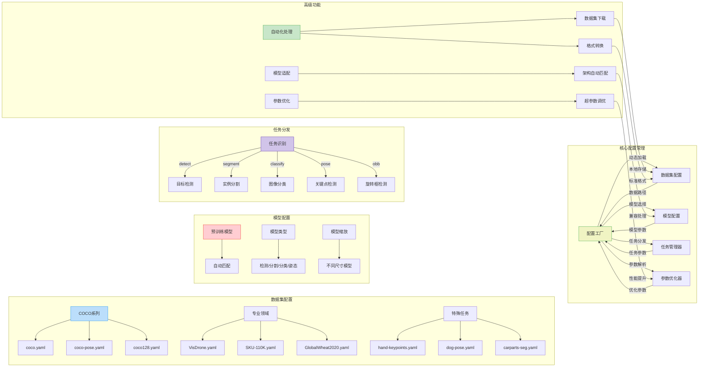
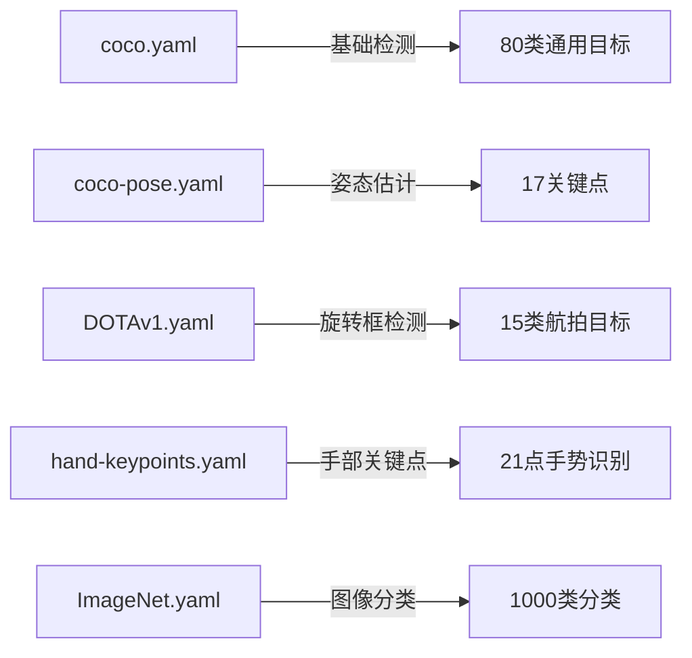
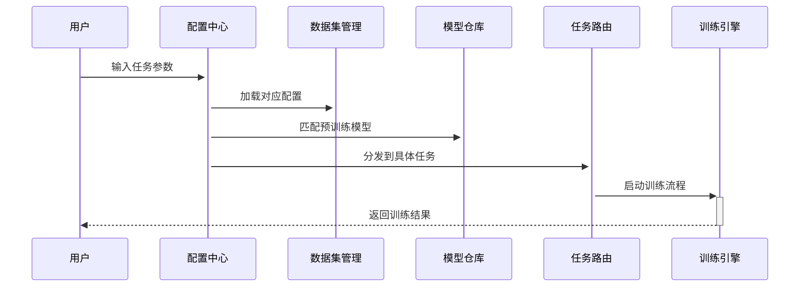
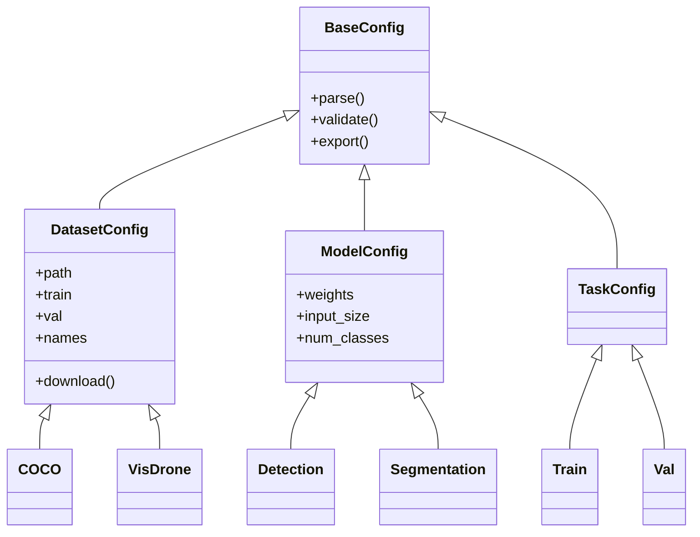

%% Ultralytics YOLOv8 配置管理架构图

这个架构图展示了以下核心流程：

配置中枢系统

动态加载机制：自动匹配数据集/模型/任务配置

智能参数解析：支持命令行/配置文件/API多种输入方式

任务路由分发：根据任务类型自动选择处理流程

数据集配置体系

通用基准数据集：COCO系列及其变种

垂直领域数据集：VisDrone(无人机)、SKU-110K(零售)等

特殊任务配置：关键点检测、旋转框等专用配置

模型配置管理

预训练模型库：自动匹配下载与加载

多任务支持：检测/分割/分类/姿态统一配置接口

弹性缩放：支持不同尺寸模型配置

任务处理流程

目标检测：标准框/旋转框检测

实例分割：像素级分割

图像分类：多类别分类

关键点检测：人体/动物/特定物体关键点

高级功能模块

自动化管道：数据集下载解压→格式转换→缓存处理

智能适配：自动匹配输入尺寸/类别数/关键点配置

参数优化：内置超参数搜索空间与进化算法

各模块通过统一配置接口连接，支持：

### 关键配置文件说明

### 配置继承体系

