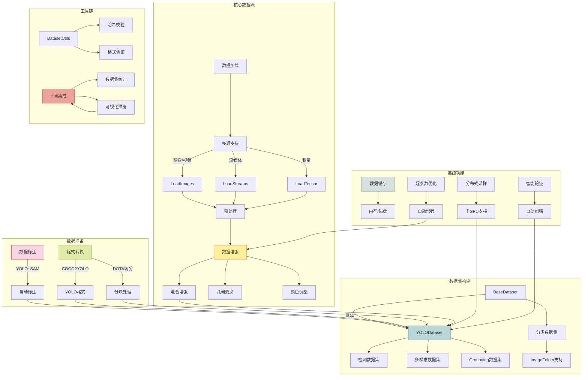
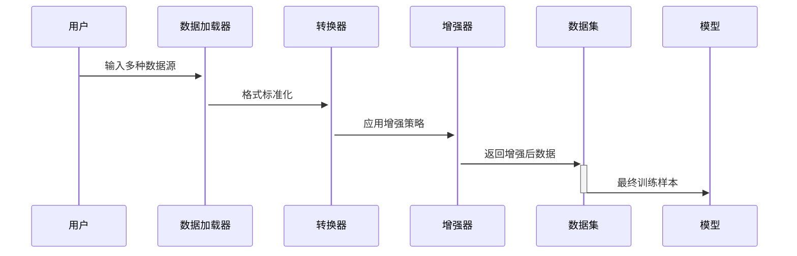

这个架构图展示了以下核心流程：
数据准备阶段
支持自动标注工具（YOLO+SAM组合）
多格式转换（COCO/DOTA→YOLO格式）
大图切分处理（DOTA专用）
核心数据流
多源数据加载（本地文件/视频流/网络流）
标准化预处理流程
丰富的增强策略：
Mosaic9混合增强
随机几何变换
颜色空间调整
分类专用增强
数据集架构
基础数据集类扩展：
检测数据集
多模态数据集
Grounding数据集
分类数据集
支持标准ImageFolder结构
高级特性
智能内存/磁盘缓存
分布式训练支持
自动数据验证
自适应增强策略
工具链集成
数据完整性校验
数据集统计分析
HUB可视化预览
自动错误修正
各模块通过标准接口连接，支持：
多任务统一数据流（检测/分类/分割）
超大规模数据集处理
端到端数据管道
自定义扩展接口