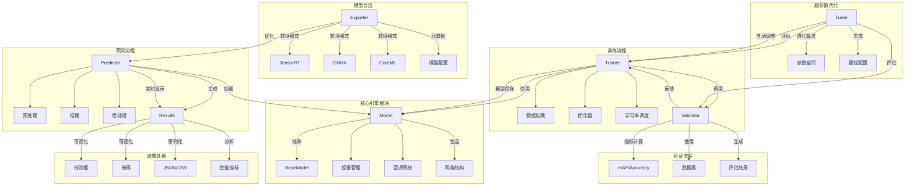

# Ultralytics YOLOv8 引擎模块架构图

这个架构图展示了以下核心流程：
模型核心（Model）
继承自基础模型类，管理设备分配和回调系统
包含具体的网络结构实现
训练循环（Trainer）
数据加载与增强
优化器与学习率调度
周期性的验证评估
模型保存与EMA管理
验证流程（Validator）
指标计算（mAP/Accuracy等）
数据集验证
生成详细评估报告
预测系统（Predictor）
多输入源支持（图像/视频/流媒体）
预处理与后处理流水线
实时可视化输出
模型导出（Exporter）
多格式转换（TensorRT/ONNX/CoreML）
元数据嵌入
跨平台优化
参数调优（Tuner）
进化算法搜索
自动参数突变
多维度评估
结果处理（Results）
可视化渲染
数据序列化
性能分析

