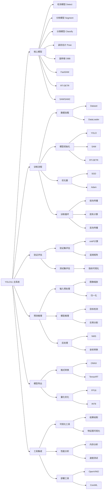
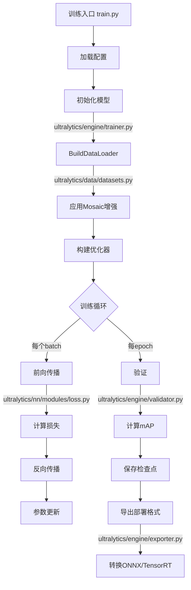
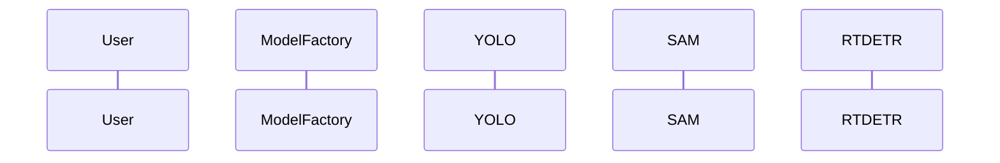
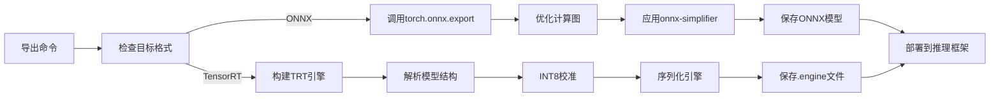

​    

### 2. 训练工作流（以YOLO为例）







​    User->>ModelFactory: 指定模型类型(yolo/sam/rtdetr)
​    ModelFactory->>YOLO: 加载YOLO模型
​    YOLO->>ultralytics/models/yolo/model.py: 构建YOLO网络
​    YOLO-->>User: 返回YOLO实例
​    
​    ModelFactory->>SAM: 加载SAM模型
​    SAM->>ultralytics/models/sam/build.py: 构建ViT编码器
​    SAM->>ultralytics/models/sam/model.py: 初始化提示编码器
​    SAM-->>User: 返回SAM实例
​    
​    ModelFactory->>RTDETR: 加载RT-DETR
​    RTDETR->>ultralytics/models/rtdetr/model.py: 构建混合编码器
​    RTDETR-->>User: 返回RT-DETR实例


### 关键脚本功能映射表：

| 脚本路径 | 主要功能 | 输入 | 输出 |
|---------|--------|------|------|
| models/yolo/model.py | YOLO模型定义 | 配置参数 | 初始化后的YOLO网络 |
| models/sam/predict.py | SAM提示推理 | 图像+提示 | 分割掩码 |
| models/rtdetr/val.py | RT-DETR验证 | 验证数据集 | mAP指标 |
| engine/trainer.py | 训练流程控制 | 训练配置 | 训练好的模型 |
| engine/validator.py | 指标计算 | 验证数据 | 评估报告 |
| nn/modules/block.py | 基础网络模块 | 输入张量 | 特征图 |
| data/datasets.py | 数据加载 | 原始图像 | 增强后的批次数据 |
| utils/ops.py | 张量操作 | 原始输出 | 后处理结果 |


### 代码阅读建议路径：

模型定义入口：

YOLO: models/yolo/model.py ➔ class DetectionModel

SAM: models/sam/build.py ➔ build_sam()

RT-DETR: models/rtdetr/model.py ➔ class RTDETRDetectionModel


```python
# ultralytics/engine/trainer.py
class BaseTrainer:
	def train(self):
		# 初始化模型
		self.model = self.get_model(...)
           
		# 数据加载
		self.train_loader = self.get_dataloader(...)
           
		# 优化器设置
		self.optimizer = self.build_optimizer(...)
           
		# 训练循环
		for epoch in range(self.epochs):
			self.train_one_epoch()
			self.validate()
			self.save_checkpoint()
```


推理后处理：

```python
   # ultralytics/models/yolo/detect/predict.py
   class DetectionPredictor:
       def postprocess(self, preds, img, orig_imgs):
           # 应用NMS
           preds = non_max_suppression(preds, ...)
           
           # 缩放坐标到原始图像尺寸
           for i, pred in enumerate(preds):
               pred[:, :4] = scale_boxes(img.shape[2:], pred[:, :4], orig_imgs[i].shape)
               
           return preds
```


    


