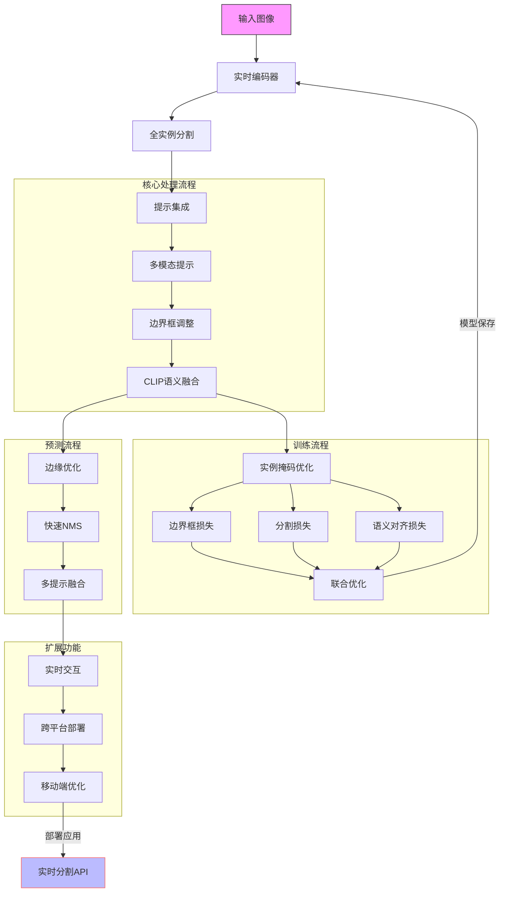

# FastSAM实时分割架构流程图

```mermaid
%% FastSAM实时分割架构流程图
graph TD
    A[输入图像] --> B[实时编码器]
    B --> C[全实例分割]
    C --> D[提示集成]
    

    subgraph 核心处理流程
        D --> E[多模态提示]
        E --> F[边界框调整]
        F --> G[CLIP语义融合]
    end
    
    subgraph 训练流程
        G --> H[实例掩码优化]
        H --> I[边界框损失]
        H --> J[分割损失]
        H --> K[语义对齐损失]
        I & J & K --> L[联合优化]
    end
    
    subgraph 预测流程
        G --> M[边缘优化]
        M --> N[快速NMS]
        N --> O[多提示融合]
    end
    
    subgraph 扩展功能
        O --> P[实时交互]
        P --> Q[跨平台部署]
        Q --> R[移动端优化]
    end
    
    L -->|模型保存| B
    R -->|部署应用| S[实时分割API]
    
    style A fill:#f9f,stroke:#333
    style S fill:#bbf,stroke:#f66 
```

