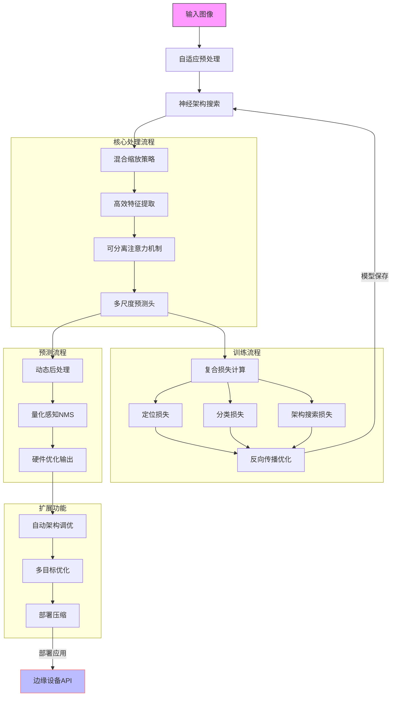

# YOLO-NAS架构流程图

```mermaid
%% YOLO-NAS架构流程图
graph TD
    A[输入图像] --> B[自适应预处理]
    B --> C[神经架构搜索]
    C --> D[混合缩放策略]
    
    subgraph 核心处理流程
        D --> E[高效特征提取]
        E --> F[可分离注意力机制]
        F --> G[多尺度预测头]
    end
    
    subgraph 训练流程
        G --> H[复合损失计算]
        H --> I[定位损失]
        H --> J[分类损失]
        H --> K[架构搜索损失]
        I & J & K --> L[反向传播优化]
    end
    
    subgraph 预测流程
        G --> M[动态后处理]
        M --> N[量化感知NMS]
        N --> O[硬件优化输出]
    end
    
    subgraph 扩展功能
        O --> P[自动架构调优]
        P --> Q[多目标优化]
        Q --> R[部署压缩]
    end
    
    L -->|模型保存| C
    R -->|部署应用| S[边缘设备API]
    
    style A fill:#f9f,stroke:#333
    style S fill:#bbf,stroke:#f66 
```

