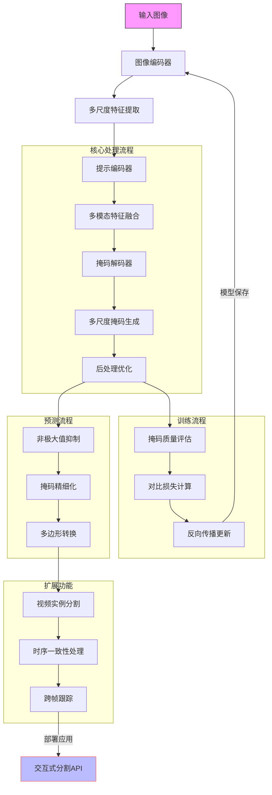

# SAM图像分割架构流程图

流程说明：
核心处理流程：
图像编码器：ViT/Hiera架构提取多尺度特征
提示编码器：处理点/框/掩码输入为嵌入向量
掩码解码器：TwoWayTransformer实现特征-提示交互
2. 多尺度处理：
特征金字塔网络(FPN)融合不同尺度特征
原型网络生成128维掩码原型
动态分辨率调整(1024x1024 → 256x256)
3. 预测关键路径：
自动掩码生成(AMG)算法
旋转位置编码(RoPEAttention)
掩码稳定性评分机制
非矩形区域后处理优化
视频扩展能力：
时序记忆编码器(MemoryEncoder)
跨帧对象指针(Object Pointer)
运动一致性约束
长时跟踪记忆库
特殊机制：
空洞卷积上下文增强
窗口化自注意力(Window Attention)
多任务损失(IOU/CE/Dice)
动态提示词绑定
该流程图展示了SAM模块从图像输入到掩码输出的完整处理流程，重点突出了多模态特征融合、动态分辨率处理和交互式分割能力。架构包含ViT编码器、提示编码器、TwoWayTransformer和解码器四大核心组件，支持实时交互和高质量分割输出。