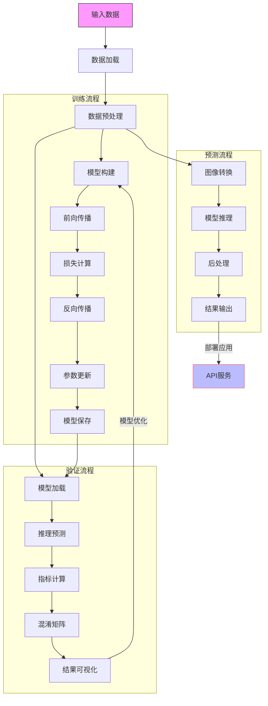

%% 分类模型架构流程图

```mermaid
%% 分类模型架构流程图
graph TD
    A[输入数据] --> B[数据加载]
    B --> C[数据预处理]
    
    subgraph 训练流程
        C --> D[模型构建]
        D --> E[前向传播]
        E --> F[损失计算]
        F --> G[反向传播]
        G --> H[参数更新]
        H --> I[模型保存]
    end
    
    subgraph 验证流程
        C --> J[模型加载]
        J --> K[推理预测]
        K --> L[指标计算]
        L --> M[混淆矩阵]
        M --> N[结果可视化]
    end
    
    subgraph 预测流程
        C --> O[图像转换]
        O --> P[模型推理]
        P --> Q[后处理]
        Q --> R[结果输出]
    end
    
    I --> J
    N -->|模型优化| D
    R -->|部署应用| S[API服务]
    
    style A fill:#f9f,stroke:#333
    style S fill:#bbf,stroke:#f66 
```