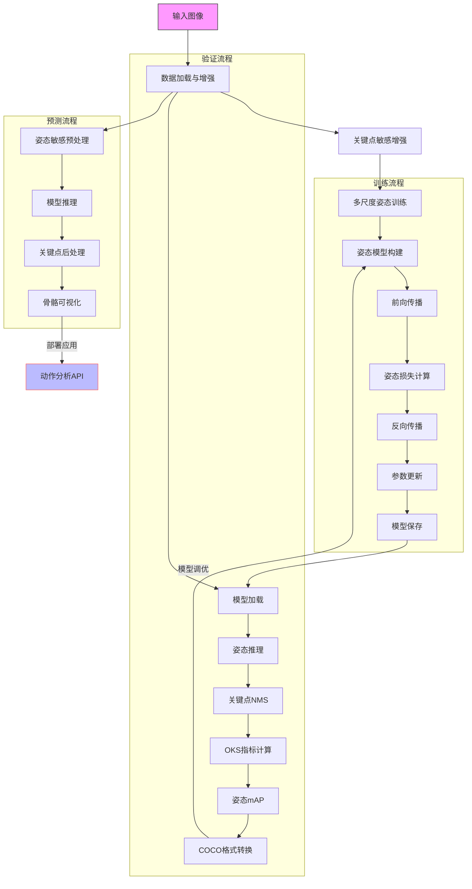

# 姿态估计模型架构流程图

```mermaid
%% 姿态估计模型架构流程图
graph TD
    A[输入图像] --> B[数据加载与增强]
    B --> C[关键点敏感增强]
    C --> D[多尺度姿态训练]
    
    subgraph 训练流程
        D --> E[姿态模型构建]
        E --> F[前向传播]
        F --> G[姿态损失计算]
        G --> H[反向传播]
        H --> I[参数更新]
        I --> J[模型保存]
    end
    
    subgraph 验证流程
        B --> K[模型加载]
        K --> L[姿态推理]
        L --> M[关键点NMS]
        M --> N[OKS指标计算]
        N --> O[姿态mAP]
        O --> P[COCO格式转换]
    end
    
    subgraph 预测流程
        B --> Q[姿态敏感预处理]
        Q --> R[模型推理]
        R --> S[关键点后处理]
        S --> T[骨骼可视化]
    end
    
    J --> K
    P -->|模型调优| E
    T -->|部署应用| U[动作分析API]
    
    style A fill:#f9f,stroke:#333
    style U fill:#bbf,stroke:#f66 
```

