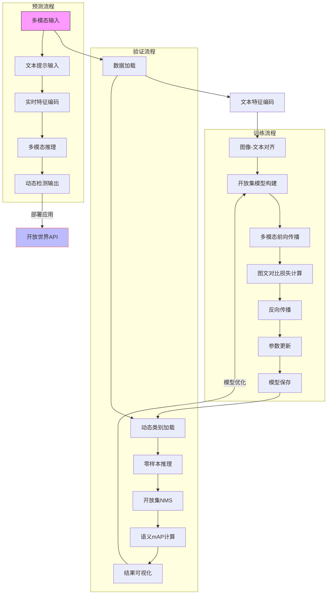

# YOLO-World开放集检测架构流程图

### 流程说明：

1. 核心训练特性：

多模态数据加载：支持YOLO数据+Grounding数据混合训练

CLIP文本编码器：冻结的ViT-B/32文本模型

图文对比损失：使用归一化特征相似度计算

2. 验证关键路径：

动态类别加载：运行时注入新类别文本特征

零样本评估：无需微调直接评估新类别

语义mAP：基于文本相似度的检测评估

预测处理流程：

实时文本编码：支持动态提示词输入

特征相似度计算：图像特征与文本特征矩阵相乘

动态输出：根据输入文本生成对应检测结果

特殊支持：

开放词汇检测：无需预定义类别

多语言支持：通过CLIP多语言编码

上下文学习：few-shot样本快速适配

扩展能力：

视频开放集跟踪

图文联合检索

跨模态知识迁移

这个流程图突出了YOLO-World模块的多模态处理能力和开放集检测特性，展示了从多模态数据输入到动态检测输出的完整流程。
