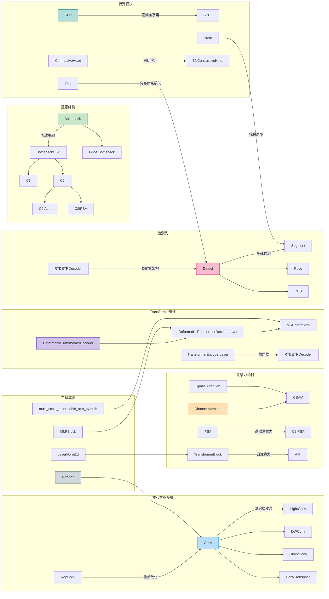
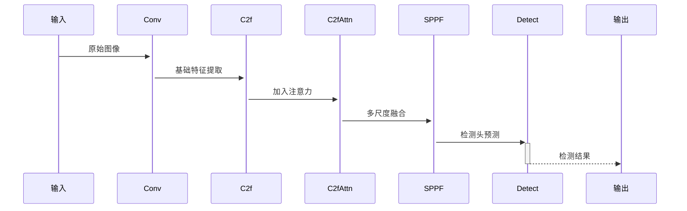
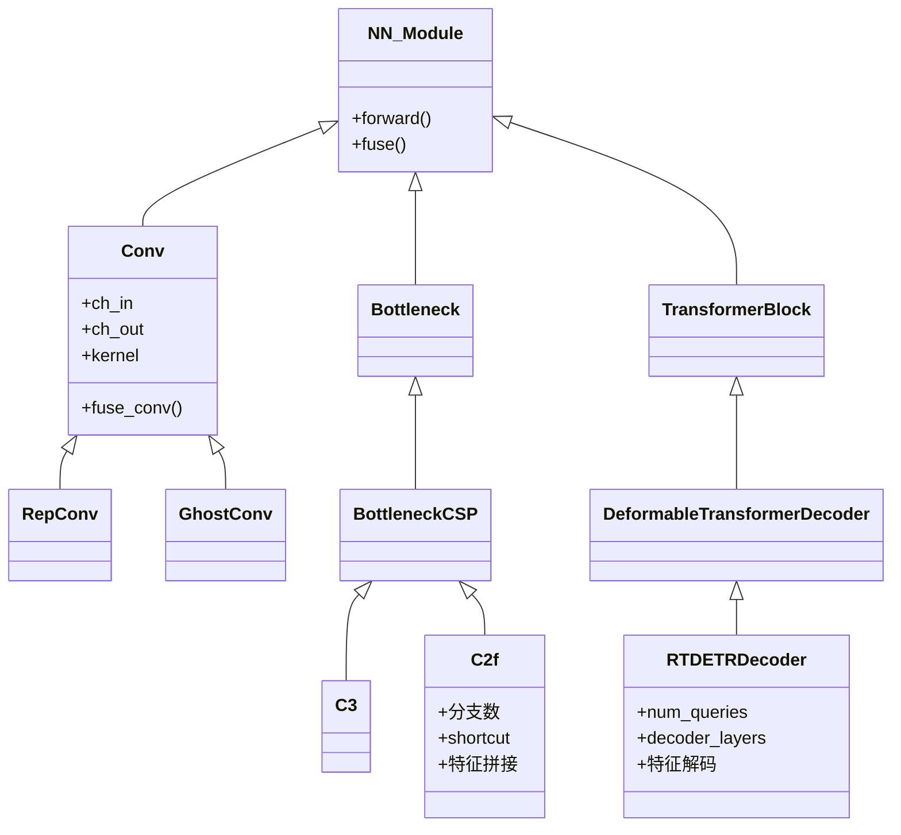

这个架构图展示了以下核心组件：

1. 基础卷积模块

   - 标准卷积与变种：深度可分离卷积、Ghost卷积、转置卷积
   - 重参数化卷积(RepConv)实现推理加速
   - 自适应padding计算(autopad)

2. 多尺度特征融合

   - SPP/SPPF空间金字塔池化
   - SPPELAN增强型池化结构
   - CBFuse跨层特征融合

3. 注意力机制

   - CBAM通道空间双注意力
   - PSA高效金字塔注意力
   - Transformer自注意力模块
   - 可变形注意力(Deformable Attention)

4. 检测头架构

   - 经典YOLO检测头(Detect)
   - 实例分割头(Segment)
   - 关键点检测头(Pose)
   - 旋转框检测头(OBB)
   - DETR式检测头(RTDETRDecoder)

5. 特殊功能模块

   - 分布焦点损失(DFL)
   - 对比学习头(ContrastiveHead)
   - 掩模原型生成(Proto)
   - 多任务兼容设计

   

### 关键数据流

### 模块继承体系

各模块通过灵活的配置支持：

- 多种卷积类型的即插即用
- 注意力机制的动态组合
- 多任务输出的统一接口
- 模型轻量化与精度平衡

