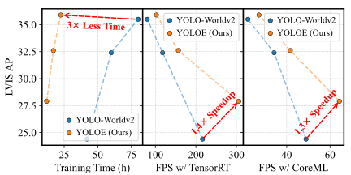
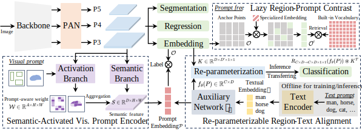
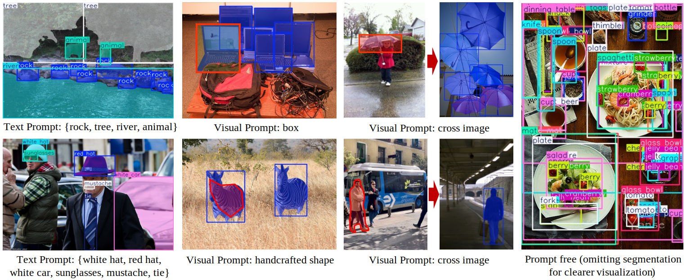

# [YOLOE: Real-Time Seeing Anything](https://arxiv.org/abs/2503.07465)

Official PyTorch implementation of **YOLOE**.

<p align="center">
   <br>
  Comparison of performance, training cost, and inference efficiency between YOLOE (Ours) and YOLO-Worldv2 in terms of open text prompts.
</p>

[YOLOE: Real-Time Seeing Anything](https://arxiv.org/abs/2503.07465).\
Ao Wang*, Lihao Liu*, Hui Chen, Zijia Lin, Jungong Han, and Guiguang Ding\
[](https://arxiv.org/abs/2503.07465) [](https://huggingface.co/jameslahm/yoloe/tree/main) [](https://huggingface.co/spaces/jameslahm/yoloe)


We introduce **YOLOE(ye)**, a highly **efficient**, **unified**, and **open** object detection and segmentation model, like human eye, under different prompt mechanisms, like *texts*, *visual inputs*, and *prompt-free paradigm*.

<!-- <p align="center">
   <br>
</p> -->

<p align="center">
   <br>
</p>


<details>
  <summary>
  <font size="+1">Abstract</font>
  </summary>
Object detection and segmentation are widely employed in computer vision applications, yet conventional models like YOLO series, while efficient and accurate, are limited by predefined categories, hindering adaptability in open scenarios. Recent open-set methods leverage text prompts, visual cues, or prompt-free paradigm to overcome this, but often compromise between performance and efficiency due to high computational demands or deployment complexity. In this work, we introduce YOLOE, which integrates detection and segmentation across diverse open prompt mechanisms within a single highly efficient model, achieving real-time seeing anything. For text prompts, we propose Re-parameterizable Region-Text Alignment (RepRTA) strategy. It refines pretrained textual embeddings via a re-parameterizable lightweight auxiliary network and enhances visual-textual alignment with zero inference and transferring overhead. For visual prompts, we present Semantic-Activated Visual Prompt Encoder (SAVPE). It employs decoupled semantic and activation branches to bring improved visual embedding and accuracy with minimal complexity. For prompt-free scenario, we introduce Lazy Region-Prompt Contrast (LRPC) strategy. It utilizes a built-in large vocabulary and specialized embedding to identify all objects, avoiding costly language model dependency. Extensive experiments show YOLOE's exceptional zero-shot performance and transferability with high inference efficiency and low training cost. Notably, on LVIS, with $3\times$ less training cost and $1.4\times$ inference speedup, YOLOE-v8-S surpasses YOLO-Worldv2-S by 3.5 AP. When transferring to COCO, YOLOE-v8-L achieves 0.6 $AP^b$ and 0.4 $AP^m$ gains over closed-set YOLOv8-L with nearly $4\times$ less training time.
</details>
<p></p>
<p align="center">
   <br>
</p>

## Performance

### Zero-shot detection evaluation

- *Fixed AP* is reported on LVIS `minival` set with text (T) / visual (V) prompts.
- Training time is for text prompts with detection based on 8 Nvidia RTX4090 GPUs.
- FPS is measured on T4 with TensorRT and iPhone 12 with CoreML, respectively.
- For training data, OG denotes Objects365v1 and GoldG.
- YOLOE can become YOLOs after re-parameterization with **zero inference and transferring overhead**.

| Model | Size | Prompt | Params | Data | Time | FPS | $AP$ | $AP_r$ | $AP_c$ | $AP_f$ | Log |
|---|---|---|---|---|---|---|---|---|---|---|---|
| [YOLOE-v8-S](https://huggingface.co/jameslahm/yoloe/blob/main/yoloe-v8s-seg.pt) | 640 | T / V | 12M / 13M | OG | 12.0h | 305.8 / 64.3 | 27.9 / 26.2 | 22.3 / 21.3 | 27.8 / 27.7 | 29.0 / 25.7 | [T](./logs/yoloe-v8s-seg) / [V](./logs/yoloe-v8s-seg-vp) |
| [YOLOE-v8-M](https://huggingface.co/jameslahm/yoloe/blob/main/yoloe-v8m-seg.pt) | 640 | T / V | 27M / 30M | OG | 17.0h | 156.7 / 41.7 | 32.6 / 31.0 | 26.9 / 27.0 | 31.9 / 31.7 | 34.4 / 31.1 | [T](./logs/yoloe-v8m-seg) / [V](./logs/yoloe-v8m-seg-vp) |
| [YOLOE-v8-L](https://huggingface.co/jameslahm/yoloe/blob/main/yoloe-v8l-seg.pt) | 640 | T / V | 45M / 50M | OG | 22.5h | 102.5 / 27.2 | 35.9 / 34.2 | 33.2 / 33.2 | 34.8 / 34.6 | 37.3 / 34.1 | [T](./logs/yoloe-v8l-seg) / [V](./logs/yoloe-v8l-seg-vp) |
| [YOLOE-11-S](https://huggingface.co/jameslahm/yoloe/blob/main/yoloe-11s-seg.pt) | 640 | T / V | 10M / 12M | OG | 13.0h | 301.2 / 73.3 | 27.5 / 26.3 | 21.4 / 22.5 | 26.8 / 27.1 | 29.3 / 26.4 | [T](./logs/yoloe-11s-seg) / [V](./logs/yoloe-11s-seg-vp) |
| [YOLOE-11-M](https://huggingface.co/jameslahm/yoloe/blob/main/yoloe-11m-seg.pt) | 640 | T / V | 21M / 27M | OG | 18.5h | 168.3 / 39.2 | 33.0 / 31.4 | 26.9 / 27.1 | 32.5 / 31.9 | 34.5 / 31.7 | [T](./logs/yoloe-11m-seg) / [V](./logs/yoloe-11m-seg-vp) |
| [YOLOE-11-L](https://huggingface.co/jameslahm/yoloe/blob/main/yoloe-11l-seg.pt) | 640 | T / V | 26M / 32M | OG | 23.5h | 130.5 / 35.1 | 35.2 / 33.7 | 29.1 / 28.1 | 35.0 / 34.6 | 36.5 / 33.8 | [T](./logs/yoloe-11l-seg) / [V](./logs/yoloe-11l-seg-vp) |

### Zero-shot segmentation evaluation

- The model is the same as above in [Zero-shot detection evaluation](#zero-shot-detection-evaluation).
- *Standard AP<sup>m</sup>* is reported on LVIS `val` set with text (T) / visual (V) prompts.

| Model | Size | Prompt | $AP^m$ | $AP_r^m$ | $AP_c^m$ | $AP_f^m$ |
|---|---|---|---|---|---|---|
| YOLOE-v8-S | 640 | T / V | 17.7 / 16.8 | 15.5 / 13.5 | 16.3 / 16.7 | 20.3 / 18.2 |
| YOLOE-v8-M | 640 | T / V | 20.8 / 20.3 | 17.2 / 17.0 | 19.2 / 20.1 | 24.2 / 22.0 |
| YOLOE-v8-L | 640 | T / V | 23.5 / 22.0 | 21.9 / 16.5 | 21.6 / 22.1 | 26.4 / 24.3 |
| YOLOE-11-S | 640 | T / V | 17.6 / 17.1 | 16.1 / 14.4 | 15.6 / 16.8 | 20.5 / 18.6 |
| YOLOE-11-M | 640 | T / V | 21.1 / 21.0 | 17.2 / 18.3 | 19.6 / 20.6 | 24.4 / 22.6 |
| YOLOE-11-L | 640 | T / V | 22.6 / 22.5 | 19.3 / 20.5 | 20.9 / 21.7 | 26.0 / 24.1 |

### Prompt-free evaluation

- The model is the same as above in [Zero-shot detection evaluation](#zero-shot-detection-evaluation) except the specialized prompt embedding.
- *Fixed AP* is reported on LVIS `minival` set and FPS is measured on Nvidia T4 GPU with Pytorch.

| Model | Size | Params | $AP$ | $AP_r$ | $AP_c$ | $AP_f$ | FPS | Log |
|---|---|---|---|---|---|---|---|---|
| [YOLOE-v8-S](https://huggingface.co/jameslahm/yoloe/blob/main/yoloe-v8s-seg-pf.pt) | 640 | 13M | 21.0 | 19.1 | 21.3 | 21.0 | 95.8 | [PF](./logs/yoloe-v8s-seg-pf/) |
| [YOLOE-v8-M](https://huggingface.co/jameslahm/yoloe/blob/main/yoloe-v8m-seg-pf.pt) | 640 | 29M | 24.7 | 22.2 | 24.5 | 25.3 | 45.9 | [PF](./logs/yoloe-v8m-seg-pf/) |
| [YOLOE-v8-L](https://huggingface.co/jameslahm/yoloe/blob/main/yoloe-v8l-seg-pf.pt) | 640 | 47M | 27.2 | 23.5 | 27.0 | 28.0 | 25.3 | [PF](./logs/yoloe-v8l-seg-pf/) |
| [YOLOE-11-S](https://huggingface.co/jameslahm/yoloe/blob/main/yoloe-11s-seg-pf.pt) | 640 | 11M | 20.6 | 18.4 | 20.2 | 21.3 | 93.0 | [PF](./logs/yoloe-11s-seg-pf/) |
| [YOLOE-11-M](https://huggingface.co/jameslahm/yoloe/blob/main/yoloe-11m-seg-pf.pt) | 640 | 24M | 25.5 | 21.6 | 25.5 | 26.1 | 42.5 | [PF](./logs/yoloe-11m-seg-pf/) |
| [YOLOE-11-L](https://huggingface.co/jameslahm/yoloe/blob/main/yoloe-11l-seg-pf.pt) | 640 | 29M | 26.3 | 22.7 | 25.8 | 27.5 | 34.9 | [PF](./logs/yoloe-11l-seg-pf/) |

### Downstream transfer on COCO

- During transferring, YOLOE-v8 / YOLOE-11 is **exactly the same** as YOLOv8 / YOLO11.
- For *Linear probing*, only the last conv in classification head is trainable.
- For *Full tuning*, all parameters are trainable.

| Model | Size | Epochs | $AP^b$ | $AP^b_{50}$ | $AP^b_{75}$ | $AP^m$ | $AP^m_{50}$ | $AP^m_{75}$ | Log |
|---|---|---|---|---|---|---|---|---|---|
| Linear probing | | | | | | | | | |
| [YOLOE-v8-S](https://huggingface.co/jameslahm/yoloe/blob/main/yoloe-v8s-seg-coco-pe.pt) | 640 | 10 | 35.6 | 51.5 | 38.9 | 30.3 | 48.2 | 32.0 | [LP](./logs/yoloe-v8s-seg-coco-pe/) |
| [YOLOE-v8-M](https://huggingface.co/jameslahm/yoloe/blob/main/yoloe-v8m-seg-coco-pe.pt) | 640 | 10 | 42.2 | 59.2 | 46.3 | 35.5 | 55.6 | 37.7 | [LP](./logs/yoloe-v8m-seg-coco-pe/) |
| [YOLOE-v8-L](https://huggingface.co/jameslahm/yoloe/blob/main/yoloe-v8l-seg-coco-pe.pt) | 640 | 10 | 45.4 | 63.3 | 50.0 | 38.3 | 59.6 | 40.8 | [LP](./logs/yoloe-v8l-seg-coco-pe/) |
| [YOLOE-11-S](https://huggingface.co/jameslahm/yoloe/blob/main/yoloe-11s-seg-coco-pe.pt) | 640 | 10 | 37.0 | 52.9 | 40.4 | 31.5 | 49.7 | 33.5 | [LP](./logs/yoloe-11s-seg-coco-pe/) |
| [YOLOE-11-M](https://huggingface.co/jameslahm/yoloe/blob/main/yoloe-11m-seg-coco-pe.pt) | 640 | 10 | 43.1 | 60.6 | 47.4 | 36.5 | 56.9 | 39.0 | [LP](./logs/yoloe-11m-seg-coco-pe/) |
| [YOLOE-11-L](https://huggingface.co/jameslahm/yoloe/blob/main/yoloe-11l-seg-coco-pe.pt) | 640 | 10 | 45.1 | 62.8 | 49.5 | 38.0 | 59.2 | 40.6 | [LP](./logs/yoloe-11l-seg-coco-pe/) |
| Full tuning | | | | | | | | | |
| [YOLOE-v8-S](https://huggingface.co/jameslahm/yoloe/blob/main/yoloe-v8s-seg-coco.pt) | 640 | 160 | 45.0 | 61.6 | 49.1 | 36.7 | 58.3 | 39.1 | [FT](./logs/yoloe-v8s-seg-coco/) |
| [YOLOE-v8-M](https://huggingface.co/jameslahm/yoloe/blob/main/yoloe-v8m-seg-coco.pt) | 640 | 80 | 50.4 | 67.0 | 55.2 | 40.9 | 63.7 | 43.5 | [FT](./logs/yoloe-v8m-seg-coco/) |
| [YOLOE-v8-L](https://huggingface.co/jameslahm/yoloe/blob/main/yoloe-v8l-seg-coco.pt) | 640 | 80 | 53.0 | 69.8 | 57.9 | 42.7 | 66.5 | 45.6 | [FT](./logs/yoloe-v8l-seg-coco/) |
| [YOLOE-11-S](https://huggingface.co/jameslahm/yoloe/blob/main/yoloe-11s-seg-coco.pt) | 640 | 160 | 46.2 | 62.9 | 50.0 | 37.6 | 59.3 | 40.1 | [FT](./logs/yoloe-11s-seg-coco/) |
| [YOLOE-11-M](https://huggingface.co/jameslahm/yoloe/blob/main/yoloe-11m-seg-coco.pt) | 640 | 80 | 51.3 | 68.3 | 56.0 | 41.5 | 64.8 | 44.3 | [FT](./logs/yoloe-11m-seg-coco/) |
| [YOLOE-11-L](https://huggingface.co/jameslahm/yoloe/blob/main/yoloe-11l-seg-coco.pt) | 640 | 80 | 52.6 | 69.7 | 57.5 | 42.4 | 66.2 | 45.2 | [FT](./logs/yoloe-11l-seg-coco/) |

## Installation
`conda` virtual environment is recommended. 
```bash
conda create -n yoloe python=3.10 -y
conda activate yoloe

pip install -r requirements.txt
pip install -e .
pip install -e lvis-api
pip install -e ml-mobileclip
pip install -e CLIP
```

## Demo
If desired objects are not identified, pleaset set a **smaller** confidence threshold, e.g., for visual prompts with handcrafted shape or cross-image prompts.
```bash
# Optional for mirror: export HF_ENDPOINT=https://hf-mirror.com
pip install gradio==4.42.0 gradio_image_prompter==0.1.0 fastapi==0.112.2
python app.py
# Please visit http://127.0.0.1:7860
```

## Prediction

### Text prompt
```bash
python predict.py
```

### Visual prompt
```bash
python predict_vp.py
```

### Prompt free
```bash
python predict_pf.py
```

## Validation

### Data
- Please download LVIS following [here](https://docs.ultralytics.com/zh/datasets/detect/lvis/) or [lvis.yaml](./ultralytics/cfg/datasets/lvis.yaml).
- We use this [`minival.txt`](./tools/lvis/minival.txt) with background images for evaluation.

```bash
# For evaluation with visual prompt, please obtain the referring data.
python tools/generate_lvis_visual_prompt_data.py
```

### Zero-shot evaluation on LVIS
- For text prompts, `python val.py`.
- For visual prompts, `python val_vp.py`

For *Fixed AP*, please refer to the comments in `val.py` and `val_vp.py`, and use `tools/eval_fixed_ap.py` for evaluation.

### Prompt-free evaluation
```bash
python val_pe_free.py
python tools/eval_open_ended.py --json ../datasets/lvis/annotations/lvis_v1_minival.json --pred runs/detect/val/predictions.json --fixed
```

### Downstream transfer on COCO
```bash
python val_coco.py
```

## Training 

The training includes three stages:
- YOLOE is trained with text prompts for detection and segmentation for 30 epochs.
- Only visual prompt encoder (SAVPE) is trained with visual prompts for 2 epochs.
- Only specialized prompt embedding for prompt free is trained for 1 epochs.

### Data

| Images | Raw Annotations | Processed Annotations |
|---|---|---|
| [Objects365v1](https://opendatalab.com/OpenDataLab/Objects365_v1) | [objects365_train.json](https://opendatalab.com/OpenDataLab/Objects365_v1) | [objects365_train_segm.json](https://huggingface.co/datasets/jameslahm/yoloe/blob/main/objects365_train_segm.json) |
| [GQA](https://nlp.stanford.edu/data/gqa/images.zip) | [	final_mixed_train_noo_coco.json](https://huggingface.co/GLIPModel/GLIP/blob/main/mdetr_annotations/final_mixed_train_no_coco.json)  | [	final_mixed_train_noo_coco_segm.json](https://huggingface.co/datasets/jameslahm/yoloe/blob/main/final_mixed_train_no_coco_segm.json) |
| [Flickr30k](https://shannon.cs.illinois.edu/DenotationGraph/) | [final_flickr_separateGT_train.json](https://huggingface.co/GLIPModel/GLIP/blob/main/mdetr_annotations/final_flickr_separateGT_train.json) | [final_flickr_separateGT_train_segm.json](https://huggingface.co/datasets/jameslahm/yoloe/blob/main/final_flickr_separateGT_train_segm.json) |

For annotations, you can directly use our preprocessed ones or use the following script to obtain the processed annotations with segmentation masks.
```bash
# Generate segmentation data
conda create -n sam2 python==3.10.16
conda activate sam2
pip install -r sam2/requirements.txt
pip install -e sam2/

python tools/generate_sam_masks.py --img-path ../datasets/Objects365v1/images/train --json-path ../datasets/Objects365v1/annotations/objects365_train.json --batch
python tools/generate_sam_masks.py --img-path ../datasets/flickr/full_images/ --json-path ../datasets/flickr/annotations/final_flickr_separateGT_train.json
python tools/generate_sam_masks.py --img-path ../datasets/mixed_grounding/gqa/images --json-path ../datasets/mixed_grounding/annotations/final_mixed_train_no_coco.json

# Generate objects365v1 labels
python tools/generate_objects365v1.py
```

Then, please generate the data and embedding cache for training.
```bash
# Generate grounding segmentation cache
python tools/generate_grounding_cache.py --img-path ../datasets/flickr/full_images/ --json-path ../datasets/flickr/annotations/final_flickr_separateGT_train_segm.json
python tools/generate_grounding_cache.py --img-path ../datasets/mixed_grounding/gqa/images --json-path ../datasets/mixed_grounding/annotations/final_mixed_train_no_coco_segm.json

# Generate train label embeddings
python tools/generate_label_embedding.py
python tools/generate_global_neg_cat.py
```
At last, please download MobileCLIP-B(LT) for text encoder.
```bash
wget https://docs-assets.developer.apple.com/ml-research/datasets/mobileclip/mobileclip_blt.pt
```

### Text prompt
```bash
# For models with l scale, please change the initialization by referring to the comments in Line 549 in ultralytics/nn/moduels/head.py
# If you want to train YOLOE only for detection, you can use `train.py` 
python train_seg.py
```

### Visual prompt
```bash
# For visual prompt, because only SAVPE is trained, we can adopt the detection pipleline with less training time

# First, obtain the detection model
python tools/convert_segm2det.py
# Then, train the SAVPE module
python train_vp.py
# After training, please use tools/get_vp_segm.py to add the segmentation head
# python tools/get_vp_segm.py
```

### Prompt free
```bash
# Generate LVIS with single class for evaluation during training
python tools/generate_lvis_sc.py

# Similar to visual prompt, because only the specialized prompt embedding is trained, we can adopt the detection pipleline with less training time
python tools/convert_segm2det.py
python train_pe_free.py
# After training, please use tools/get_pf_free_segm.py to add the segmentation head
# python tools/get_pf_free_segm.py
```

## Transferring
After pretraining, YOLOE-v8 / YOLOE-11 can be re-parameterized into the same architecture as YOLOv8 / YOLO11, with **zero overhead** for transferring.

### Linear probing
Only the last conv, ie., the prompt embedding, is trainable.
```bash
python train_pe.py
```

### Full tuning
All parameters are trainable, for better performance.
```bash
# For models with s scale, please change the epochs to 160 for longer training
python train_pe_all.py
```

## Export
After re-parameterization, YOLOE-v8 / YOLOE-11 can be exported into the identical format as YOLOv8 / YOLO11.
```bash
pip install onnx coremltools onnxslim
python export.py
```

## Benchmark
- For TensorRT, please refer to `benchmark.sh`.
- For CoreML, please use the benchmark tool from [XCode 14](https://developer.apple.com/videos/play/wwdc2022/10027/).
- For prompt-free setting, please refer to `tools/benchmark_pf.py`.

## Acknowledgement

The code base is built with [ultralytics](https://github.com/ultralytics/ultralytics), [YOLO-World](https://github.com/AILab-CVC/YOLO-World), [MobileCLIP](https://github.com/apple/ml-mobileclip), [lvis-api](https://github.com/lvis-dataset/lvis-api), [CLIP](https://github.com/openai/CLIP), and [GenerateU](https://github.com/FoundationVision/GenerateU).

Thanks for the great implementations! 

## Citation

If our code or models help your work, please cite our paper:
```BibTeX
@misc{wang2025yoloerealtimeseeing,
      title={YOLOE: Real-Time Seeing Anything}, 
      author={Ao Wang and Lihao Liu and Hui Chen and Zijia Lin and Jungong Han and Guiguang Ding},
      year={2025},
      eprint={2503.07465},
      archivePrefix={arXiv},
      primaryClass={cs.CV},
      url={https://arxiv.org/abs/2503.07465}, 
}
```
